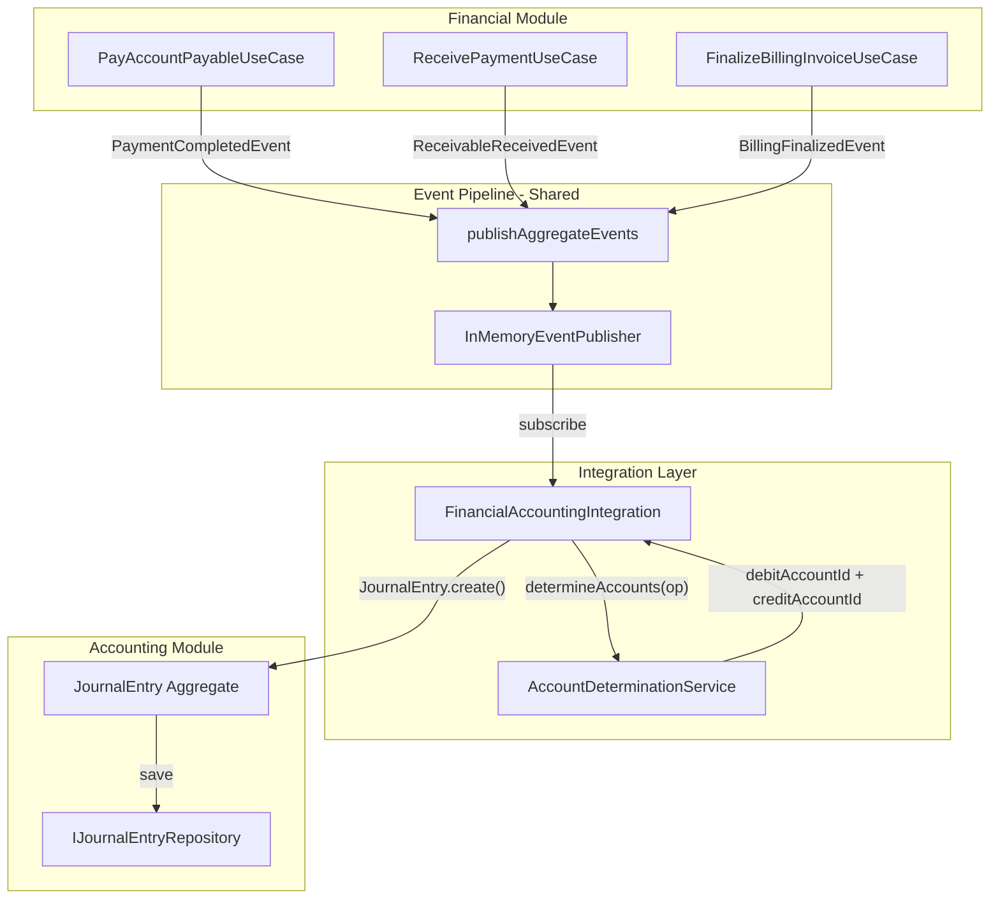
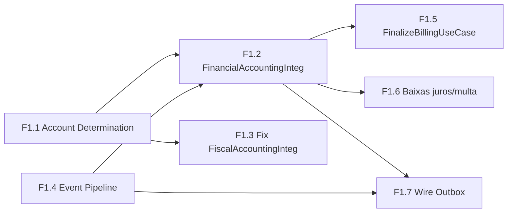

# Fase 1: Integracao Contabil — Plano de Implementacao

## Contexto e Justificativa

### Problema Central

O AuraCore Financial movimenta dinheiro (pagamentos, recebimentos, faturamento) sem gerar **nenhum** lancamento contabil automatico. Isso torna o SPED ECD impossivel e viola o principio fundamental de qualquer ERP enterprise: **todo centavo deve ter rastro contabil**.

### Estado Atual Diagnosticado

**Pipeline de Eventos — COMPLETAMENTE QUEBRADO:**

- `CreatePayableUseCase`, `PayAccountPayableUseCase`, `CancelPayableUseCase` adicionam eventos ao aggregate mas **nunca chamam** `publishAggregateEvents()`
- `DomainEventDispatcher` esta registrado no DI mas `dispatch()` **nunca e invocado** por ninguem
- `InMemoryEventPublisher` (shared) nao tem **nenhum subscriber**
- Outbox existe mas `saveToOutbox()` e `OutboxProcessor.start()` **nunca sao chamados**
- Unico use case que publica eventos: `PostJournalEntryUseCase` (Accounting)

**Integracao Financial -> Accounting — INEXISTENTE:**

- Pagamento de titulo: nao gera lancamento (D: Fornecedores / C: Banco)
- Recebimento de titulo: nao gera lancamento (D: Banco / C: Clientes)
- Faturamento (billing): nao gera lancamento (D: Clientes / C: Receita)
- `AccountReceivable` nao emite **nenhum** domain event

**FiscalAccountingIntegration — IDs HARDCODED:**

- 7 IDs fixos ('1' a '7') em [FiscalAccountingIntegration.ts](src/modules/fiscal/application/services/FiscalAccountingIntegration.ts)
- Cada empresa tem Plano de Contas proprio — hardcoded funciona para UMA, falha para TODAS as outras
- Typo: `isAuthrized` (linha 58)

**Billing — SQL DIRETO, SEM DDD:**

- [finalize/route.ts](src/app/api/financial/billing/[id]/finalize/route.ts) usa `withMssqlTransaction` + SQL direto
- Nao calcula retencoes (IRRF, PIS, COFINS, CSLL, ISS)
- Nao gera evento `BillingFinalizedEvent`
- Nao gera lancamento contabil

### Impacto Legal

| Obrigacao          | Base Legal            | Multa        | Impacto da Fase 1                    |
| ------------------ | --------------------- | ------------ | ------------------------------------ |
| SPED ECD           | IN RFB 2003/2021      | R$ 5.000/mes | Sem lancamentos auto, ECD incompleta |
| SPED Contribuicoes | Art. 12 Lei 8.218/91  | R$ 5.000/mes | Retencoes nao calculadas             |
| IRRF s/ servicos   | Art. 64 Lei 9.430/96  | 1.5%         | Billing sem retencao                 |
| PIS/COFINS retidos | Art. 30 Lei 10.833/03 | 0.65% + 3%   | Billing sem retencao                 |
| CSLL retida        | Art. 30 Lei 10.833/03 | 1%           | Billing sem retencao                 |
| ISS retido         | LC 116/03             | 2-5%         | Billing sem retencao                 |

---

## Arquitetura da Solucao

### Fluxo Alvo (apos Fase 1)

### Dependencias entre Sub-tarefas

---

## Sub-tarefa F1.1: Account Determination (Determinacao de Contas Contabeis)

**Referencia SAP:** OBYS/OKB9 — Account Determination for Automatic Posting

### O que e

Tabela configuravel que mapeia **tipo de operacao** para **contas contabeis (debito/credito)**. Substitui os 7 IDs hardcoded e permite que cada empresa configure seu proprio plano de contas.

### Artefatos a criar

**Domain:**

- `src/modules/accounting/domain/entities/AccountDetermination.ts` — Entity com `create()` + `reconstitute()`
  - Props: `organizationId`, `branchId`, `operationType` (enum), `debitAccountId`, `debitAccountCode`, `creditAccountId`, `creditAccountCode`, `description`, `isActive`
- `src/modules/accounting/domain/value-objects/OperationType.ts` — Value Object enum
  - Valores: `PURCHASE_NFE`, `SALE_NFE`, `CTE_FREIGHT`, `PAYMENT_SUPPLIER`, `PAYMENT_BANK`, `RECEIPT_CUSTOMER`, `RECEIPT_BANK`, `BILLING_REVENUE`, `BILLING_ISS`, `BILLING_IRRF`, `BILLING_PIS`, `BILLING_COFINS`, `BILLING_CSLL`, `CANCELLATION_REVERSAL`, `INTEREST_INCOME`, `INTEREST_EXPENSE`, `FINE_INCOME`, `FINE_EXPENSE`, `DISCOUNT_GIVEN`, `DISCOUNT_RECEIVED`, `BANK_FEE`, `IOF`, `GENERIC`
- `src/modules/accounting/domain/services/AccountDeterminationService.ts` — Domain Service (stateless)
  - Metodo: `determineAccounts(rules: AccountDetermination[], operationType: OperationType): Result<{debitAccountId, debitAccountCode, creditAccountId, creditAccountCode}, string>`

**Ports:**

- `src/modules/accounting/domain/ports/output/IAccountDeterminationRepository.ts`
  - `findByOperationType(orgId, branchId, operationType): Promise<AccountDetermination | null>`
  - `findAll(orgId, branchId): Promise<AccountDetermination[]>`
  - `save(entity): Promise<void>`

**Infrastructure:**

- `src/modules/accounting/infrastructure/persistence/schemas/AccountDeterminationSchema.ts`
  - Tabela `account_determination` com indices tenant + unique (orgId, branchId, operationType)
- `src/modules/accounting/infrastructure/persistence/mappers/AccountDeterminationMapper.ts`
- `src/modules/accounting/infrastructure/persistence/repositories/DrizzleAccountDeterminationRepository.ts`

**DI:**

- Registrar em `AccountingModule.ts`: token `TOKENS.AccountDeterminationRepository`, `TOKENS.AccountDeterminationService` (se necessario via app service wrapper)

**Seed Data (~23 operacoes):**

- Script ou use case de seed com regras padrao baseadas no Plano de Contas brasileiro padrao

### Impacto em arquivos existentes

- [AccountingModule.ts](src/modules/accounting/infrastructure/di/AccountingModule.ts) — novos registros DI
- [tokens.ts](src/shared/infrastructure/di/tokens.ts) — novos tokens
- [schema.ts](src/lib/db/schema.ts) — export do novo schema (quando barrel for habilitado)

---

## Sub-tarefa F1.4: Consertar Pipeline de Eventos

### Problemas identificados (3 quebras)

1. **Financial Use Cases nao publicam eventos** — `CreatePayableUseCase`, `PayAccountPayableUseCase`, `CancelPayableUseCase` chamam `repository.save()` mas nao chamam `publishAggregateEvents()`
2. **DomainEventDispatcher e IEventPublisher sao sistemas paralelos desconectados** — `DomainEventDispatcher` tem handlers mas ninguem chama `dispatch()`. `InMemoryEventPublisher` publica mas nao tem subscribers.
3. **Nao existe subscriber cross-module** — Handlers sao todos log-only dentro de Financial

### Solucao: Unificar em `InMemoryEventPublisher`

**Passo 1:** Adicionar `publishAggregateEvents()` nos use cases Financial:

- [CreatePayableUseCase.ts](src/modules/financial/application/commands/CreatePayableUseCase.ts) — apos `repository.save()`
- [PayAccountPayableUseCase.ts](src/modules/financial/application/commands/PayAccountPayableUseCase.ts) — apos `repository.save()`
- [CancelPayableUseCase.ts](src/modules/financial/application/commands/CancelPayableUseCase.ts) — apos `repository.save()`
- [ReceivePaymentUseCase.ts](src/modules/financial/application/commands/ReceivePaymentUseCase.ts) — apos save (necessita injetar `IEventPublisher`)

**Passo 2:** Criar domain events faltantes em `AccountReceivable`:

- `ReceivableReceivedEvent` — emitido em `receivePayment()`
- `ReceivableCancelledEvent` — emitido em `cancel()`

**Passo 3:** Registrar subscribers no `InMemoryEventPublisher` via um `EventSubscriptionBootstrap`:

- Criar `src/shared/infrastructure/events/EventSubscriptionBootstrap.ts`
- No startup (`instrumentation.ts`), registrar handlers:
  - `PaymentCompleted` -> `FinancialAccountingIntegration.onPaymentCompleted()`
  - `ReceivableReceived` -> `FinancialAccountingIntegration.onReceivableReceived()`
  - `BillingFinalized` -> `FinancialAccountingIntegration.onBillingFinalized()`
  - `PayableCancelled` -> `FinancialAccountingIntegration.onPayableCancelled()`

**Passo 4:** Manter `DomainEventDispatcher` (Financial) como subscriber tambem:

- Registrar `DomainEventDispatcher.dispatch()` como subscriber no `InMemoryEventPublisher` para os 4 tipos de eventos Financial
- Isso preserva os handlers existentes (log) sem quebrar nada

### Impacto em arquivos existentes

- 4 Use Cases Financial (adicionar inject IEventPublisher + publishAggregateEvents)
- [AccountReceivable.ts](src/modules/financial/domain/entities/AccountReceivable.ts) — adicionar eventos
- `domain/events/` — 2 novos eventos (ReceivableReceivedEvent, ReceivableCancelledEvent)
- [instrumentation.ts](src/instrumentation.ts) — bootstrap de subscriptions
- Novo: `EventSubscriptionBootstrap.ts` em shared

---

## Sub-tarefa F1.2: FinancialAccountingIntegration

### O que e

Service que gera lancamentos contabeis automaticos para **todas** as operacoes financeiras. Equivalente ao FI Document do SAP ou CT2 do TOTVS Protheus.

### Artefatos a criar

**Service:**

- `src/modules/financial/application/services/FinancialAccountingIntegration.ts`

**Handlers (metodos do service):**

| Handler                | Evento                  | Lancamento Contabil                                   |
| ---------------------- | ----------------------- | ----------------------------------------------------- |
| `onPaymentCompleted`   | PaymentCompletedEvent   | D: Fornecedores (2.1.01) / C: Banco (1.1.04)          |
| `onReceivableReceived` | ReceivableReceivedEvent | D: Banco (1.1.04) / C: Clientes (1.1.02)              |
| `onBillingFinalized`   | BillingFinalizedEvent   | D: Clientes (1.1.02) / C: Receita Transporte (3.1.01) |
| `onPayableCancelled`   | PayableCancelledEvent   | Estorno do lancamento original (reversal)             |
| `onInterestCharged`    | (futuro)                | D: Banco / C: Receitas Financeiras (3.3.01)           |
| `onDiscountGiven`      | (futuro)                | D: Descontos Concedidos (3.2.05) / C: Clientes        |

**Dependencias injetadas:**

- `IAccountDeterminationRepository` — lookup de contas (F1.1)
- `IJournalEntryRepository` — salvar lancamentos
- `IEventPublisher` — receber eventos
- `ILogger`

**Logica de cada handler:**

1. Recebe evento com `aggregateId` (payableId/receivableId)
2. Busca dados complementares se necessario (valor, fornecedor, banco)
3. Chama `AccountDeterminationService.determineAccounts(operationType, orgId, branchId)`
4. Cria `JournalEntry` com linhas de debito e credito
5. Salva via `IJournalEntryRepository`
6. Log estruturado

**DI:**

- Registrar em `FinancialModule.ts`

### Impacto em arquivos existentes

- [FinancialModule.ts](src/modules/financial/infrastructure/di/FinancialModule.ts) — registro DI
- [tokens.ts](src/shared/infrastructure/di/tokens.ts) — novo token

---

## Sub-tarefa F1.3: Corrigir FiscalAccountingIntegration

### O que mudar

Substituir os 7 IDs hardcoded por lookup via `AccountDeterminationService`.

### Mudancas em [FiscalAccountingIntegration.ts](src/modules/fiscal/application/services/FiscalAccountingIntegration.ts)

- Injetar `IAccountDeterminationRepository` via DI
- Em cada metodo (`addInboundNfeLines`, `addOutboundNfeLines`, `addCteLines`, `addGenericLines`):
  - Substituir `accountId: '1'` por `accountDeterminationRepo.findByOperationType(orgId, branchId, OperationType.PURCHASE_NFE)`
  - Se nao encontrar regra, usar fallback com log de warning
- Corrigir typo: `isAuthrized` -> `isAuthorized` (linha 58 e entity)

### Impacto em arquivos existentes

- [FiscalAccountingIntegration.ts](src/modules/fiscal/application/services/FiscalAccountingIntegration.ts) — refatoracao completa
- [FiscalDocument.ts](src/modules/fiscal/domain/entities/FiscalDocument.ts) — corrigir typo `isAuthrized`
- [FiscalModule.ts](src/modules/fiscal/infrastructure/di/FiscalModule.ts) — injetar AccountDeterminationRepository

---

## Sub-tarefa F1.5: FinalizeBillingInvoiceUseCase (DDD)

### O que e

Migrar a logica de `finalize/route.ts` (SQL direto) para um Use Case DDD completo com calculo de retencoes.

### Artefatos a criar

**Domain:**

- `BillingFinalizedEvent` em `src/modules/financial/domain/events/`

**Application:**

- `src/modules/financial/application/commands/FinalizeBillingInvoiceUseCase.ts`

**Fluxo do Use Case:**

1. Carregar invoice (validar status DRAFT)
2. Validar pre-requisitos (barcode presente)
3. Calcular retencoes na fonte (se aplicavel):
  - IRRF 1.5% (Art. 64 Lei 9.430/96)
  - PIS 0.65% + COFINS 3% + CSLL 1% (Art. 30 Lei 10.833/03)
  - ISS 2-5% (LC 116/03, conforme municipio)
4. Criar `AccountReceivable` (valor liquido = bruto - retencoes)
5. Atualizar invoice: status FINALIZED, vincular AR
6. Emitir `BillingFinalizedEvent`
7. Integracao contabil sera tratada pelo handler (F1.2)

**Nota sobre retencoes:**

- Para Fase 1, implementar calculo basico com aliquotas fixas conforme legislacao
- Tabela de configuracao de retencoes por tipo de servico sera Fase 3 (WithholdingTaxCalculator completo)
- Fase 1 atende o minimo legal para operacao

### Impacto em arquivos existentes

- [finalize/route.ts](src/app/api/financial/billing/[id]/finalize/route.ts) — delegar para Use Case
- [FinancialModule.ts](src/modules/financial/infrastructure/di/FinancialModule.ts) — registro DI

---

## Sub-tarefa F1.6: Baixas com Juros/Multa/Desconto

### O que mudar

Estender `PayAccountPayableUseCase` e `ReceivePaymentUseCase` para suportar componentes adicionais.

### Mudancas

**PayAccountPayableUseCase:**

- Input: adicionar campos opcionais `interest`, `fine`, `discount`, `bankFee`
- Logica: valor efetivo = principal + interest + fine - discount + bankFee
- Evento: `PaymentCompletedEvent` enriquecido com breakdown

**ReceivePaymentUseCase:**

- Input: adicionar campos opcionais `interest`, `fine`, `discount`
- Logica: valor efetivo = principal + interest + fine - discount
- Evento: `ReceivableReceivedEvent` com breakdown

**Lancamentos contabeis (via F1.2):**

- Juros recebidos: D: Banco / C: Receitas Financeiras
- Juros pagos: D: Despesas Financeiras / C: Banco
- Multas recebidas: D: Banco / C: Multas Recebidas
- Descontos concedidos: D: Descontos Concedidos / C: Clientes

---

## Sub-tarefa F1.7: Wire Transactional Outbox

### O que e

Conectar a infraestrutura de Outbox que ja existe mas nao esta wired. Garante que eventos de dominio sao persistidos na mesma transacao que a mudanca de estado.

### Mudancas

- Substituir `publishAggregateEvents` direto por `saveToOutbox()` dentro da transacao dos Use Cases criticos
- Iniciar `OutboxProcessor` no startup (`instrumentation.ts`)
- `OutboxProcessor` le outbox, publica via `InMemoryEventPublisher`, marca como processed

### Impacto em arquivos existentes

- [instrumentation.ts](src/instrumentation.ts) — iniciar OutboxProcessor
- Use Cases que usam transacao — chamar `saveToOutbox()` ao inves de publish direto
- [DrizzleUnitOfWork.ts](src/shared/infrastructure/persistence/DrizzleUnitOfWork.ts) — possivelmente integrar outbox

---

## Ordem de Execucao

| Etapa | Sub-tarefa                           | Dependencia                 | Estimativa                     |
| ----- | ------------------------------------ | --------------------------- | ------------------------------ |
| 1     | F1.1 Account Determination           | Nenhuma                     | Entity + Schema + Repo + Seed  |
| 2     | F1.4 Event Pipeline                  | Nenhuma (paralelo com F1.1) | Use Cases + Events + Bootstrap |
| 3     | F1.2 FinancialAccountingIntegration  | F1.1 + F1.4                 | Service + Handlers             |
| 4     | F1.3 Fix FiscalAccountingIntegration | F1.1                        | Refatoracao                    |
| 5     | F1.5 FinalizeBillingInvoiceUseCase   | F1.2                        | Use Case + Retencoes           |
| 6     | F1.6 Baixas juros/multa/desconto     | F1.2                        | Extend Use Cases               |
| 7     | F1.7 Wire Outbox                     | F1.2 + F1.4                 | Wiring                         |

---

## Verificacoes por Etapa

Cada etapa deve passar:

- `npx tsc --noEmit` = 0 erros
- `npm test -- --run` = 100% passando
- `grep 'as any' src/` = 0 resultados
- `check_cursor_issues` = 0 issues
- Testes unitarios para cada artefato novo

---

## Arquivos Criticos que NAO devem ser quebrados

- `src/services/accounting-engine.ts` — legacy, mas ainda usado
- `src/modules/fiscal/application/services/FiscalAccountingIntegration.ts` — sera refatorado, nao removido
- `src/modules/financial/infrastructure/events/DomainEventDispatcher.ts` — sera preservado como subscriber
- `src/shared/infrastructure/events/InMemoryEventPublisher.ts` — sera o hub central

