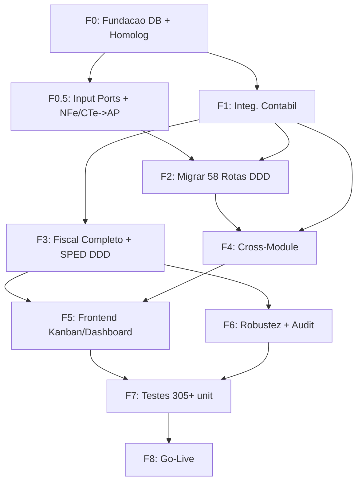

# Plano de Producao: Modulos Financial, Fiscal e Accounting (v2 — Consolidado)

## Contexto e Decisoes Arquiteturais

**Decisao 1:** Criar tabelas DDD novas (UUID char(36)), apagar tabelas legacy (INT). Nao ha dados a migrar.
**Decisao 2:** Escopo fiscal completo — emissao real CTe/NFe, SPED Fiscal/ECD/Contribuicoes, impostos retidos.
**Decisao 3:** Usar modulo Strategic como referencia arquitetural (100% DDD, frontend rico).
**Decisao 4:** Deploy gradual com checkpoints intermediarios (nao big-bang).

### Achado Critico Principal

Os modulos DDD definem schemas com `char(36)` UUID, mas as tabelas fisicas usam `INT IDENTITY`. Ambos apontam para o mesmo nome de tabela. Qualquer INSERT via DDD modulo FALHA:

```
Conversion failed when converting nvarchar '550e8400-...' to data type int
```

**Arquivos afetados pela dualidade:**

- Legacy: [src/lib/db/schema.ts](src/lib/db/schema.ts) (linhas 670-717: `accountsPayable`), [src/lib/db/schema/accounting.ts](src/lib/db/schema/accounting.ts) (`journalEntries`, `journalEntryLines`, `financialTransactions`)
- DDD: [PayableSchema.ts](src/modules/financial/infrastructure/persistence/schemas/PayableSchema.ts), [ReceivableSchema.ts](src/modules/financial/infrastructure/persistence/schemas/ReceivableSchema.ts), [JournalEntrySchema.ts](src/modules/accounting/infrastructure/persistence/schemas/JournalEntrySchema.ts)

### Pre-requisitos Externos

- Contratar **contador especializado em transportadoras** (~20h/semana consultoria) para validar account determination, retencoes, e SPED
- Adquirir **certificado digital SEFAZ A1** para ambiente de homologacao

### Fontes Documentais Cruzadas

Este plano incorpora itens identificados em:

- [FINANCEIRO.md](docs/architecture/domains/FINANCEIRO.md) — escopo do dominio (baixas com juros/multa/desconto, CNAB, DDA, conciliacao)
- [CONTABIL.md](docs/architecture/domains/CONTABIL.md) — entidades e fluxos contabeis
- [E7.20_PLANO_CRIACAO.md](docs/planning/E7.20_PLANO_CRIACAO.md) — 27 Input Ports (ARCH-010) nao criados (Financial 11, Fiscal 16)
- [API_ROUTES_MIGRATION_PLAN.md](docs/technical-debt/API_ROUTES_MIGRATION_PLAN.md) — 58 rotas fiscal+financial para migrar a DDD
- [ENTERPRISE_FEATURES_ROADMAP.md](docs/technical-debt/ENTERPRISE_FEATURES_ROADMAP.md) — InMemoryEventPublisher ja existe, Transactional Outbox planejado
- [DT-001-SCHEMA-OBSOLETO-FISCAL.md](docs/debito-tecnico/DT-001-SCHEMA-OBSOLETO-FISCAL.md) — schema duplicado fiscal_document_items (net_amount vs total_value)
- [PLANEJAMENTO_CONTAS_PAGAR_RECEBER.md](_documentation/planning/PLANEJAMENTO_CONTAS_PAGAR_RECEBER.md) — NFe->AP automatico, CTe->AR automatico
- [E7.17_PLANO_MIGRACAO.md](docs/planning/E7.17_PLANO_MIGRACAO.md) — SPED legado -> DDD (APIs ainda usam legado)
- [TAX_REFORM_2026_README.md](docs/fiscal/TAX_REFORM_2026_README.md) — IBS/CBS implementado em DDD, falta validacao real SEFAZ
- [TODO_TRIAGE_2026-02-11.md](docs/technical-debt/TODO_TRIAGE_2026-02-11.md) — 347 TODOs triados (15 SEFAZ real P1, 10 financial validations P2)
- [BENCHMARK_ESTRUTURA_CONTABIL_FISCAL.md](_documentation/technical/BENCHMARK_ESTRUTURA_CONTABIL_FISCAL.md) — validacoes de integridade contabil (NBC TG)

### Itens Planejados e NAO Implementados (Consolidado da Documentacao)

**Producao-critico (incluido neste plano):**

- 27 Input Ports ARCH-010 (E7.20) — Financial 11, Fiscal 16
- NFe compra -> contas a pagar automatico (parcelas de `<dup>`)
- CTe externo (redespacho) -> contas a pagar automatico
- SPED APIs migrando de legado para DDD Use Cases (E7.17)
- Schema duplicado fiscal_document_items (DT-001)
- Baixas de titulos com juros/multa/desconto
- Accounting integrity validations (bloquear exclusao conta com lancamentos)
- Transactional Outbox Pattern (garantir eventos nao perdidos)
- Balancete/DRE obrigatorios (relatórios contabeis)

**Pos-producao (NAO incluido — roadmap futuro):**

- CNAB remessas/retornos
- DDA integration (BTG)
- Budget/Orcamento anual
- Multi-Book Accounting (Fiscal/IFRS/Gerencial)
- Provisoes e Accruals (ferias, 13o)
- Consolidacao multi-empresa
- Modulo de custos (ABC, absorcao)
- BI Integration (Power BI OData)
- Import CSV/Excel plano de contas
- NCM classification engine completo
- 2FA/TOTP
- Message Broker real (Redis Pub/Sub — substituir InMemoryEventPublisher)

---

## FASE 0: Fundacao DDD + Setup Homologacao (Semana 1, ~25h)

### F0.1 — Migration SQL consolidada + resolver DT-001

Uma unica migration `0069_drop_legacy_create_ddd.sql` que:

1. DROP tabelas legacy conflitantes: `payments`, `accounts_payable`, `accounts_receivable`, `journal_entry_lines`, `journal_entries`, `financial_transactions`
2. As tabelas DDD serao criadas via `npx drizzle-kit push` (schemas: PayableSchema, ReceivableSchema, JournalEntrySchema)
3. **Resolver DT-001:** Remover/alinhar schema duplicado de `fiscal_document_items` em [FiscalDocumentSchema.ts](src/modules/fiscal/infrastructure/persistence/FiscalDocumentSchema.ts) — consolidar campo `net_amount` vs `total_value` (o schema ativo em `src/lib/db/schema/accounting.ts` usa `netAmount`)
4. ALTER tabelas existentes:
  - `billing_items`: ADD `organization_id INT`, `branch_id INT`, `deleted_at DATETIME2`
  - `fiscal_documents`, `fiscal_document_items`: ADD `currency VARCHAR(3) DEFAULT 'BRL'`
  - `fiscal_document_items`: ADD `branch_id INT`
  - `financial_transactions` (se recriada): incluir `currency` no DDD schema
5. Corrigir multi-tenancy nos schemas DDD ANTES do push:
  - `paymentsTable`: adicionar `organizationId`, `branchId`, `deletedAt`
  - `receivableReceiptsTable`: idem
  - `journalEntryLinesTable`: idem
6. Indices compostos para ~15 tabelas (tenant, status, date, FKs) — todos com `WHERE deleted_at IS NULL`

Remover de [src/lib/db/schema.ts](src/lib/db/schema.ts): definicoes legacy de `accountsPayable` (~linha 670), `accountsReceivable`, e de [src/lib/db/schema/accounting.ts](src/lib/db/schema/accounting.ts): `journalEntries`, `journalEntryLines`, `financialTransactions` + suas `relations`.

### F0.2 — Barrel files e exports

Criar `src/modules/financial/infrastructure/persistence/schemas/index.ts` (exportando PayableSchema, ReceivableSchema, expense/*, receipt/*).
Criar `src/modules/accounting/infrastructure/persistence/schemas/index.ts` (exportando JournalEntrySchema).
Adicionar em [src/lib/db/schema.ts](src/lib/db/schema.ts):

```typescript
export * from '@/modules/financial/infrastructure/persistence/schemas';
export * from '@/modules/accounting/infrastructure/persistence/schemas';
```

### F0.3 — Atualizar imports V1 + validar

Substituir em ~40 rotas `src/app/api/financial/`:

```typescript
// DE: import { accountsPayable } from "@/lib/db/schema";
// PARA: import { accountsPayableTable } from "@/modules/financial/infrastructure/persistence/schemas";
```

Atencao: nomes de coluna podem diferir. Cada rota precisa revisao individual.

**Validacao:** Testar INSERT em 5 rotas principais (payables, receivables, billing, journal-entries, payments). Confirmar UUID funcionando.

### F0.4 — Setup ambiente homologacao

- SQL Server 2022 (container Docker ou cloud)
- Certificado digital SEFAZ A1 homologacao (.pfx)
- Credenciais SEFAZ (CSC, ID Token para NFCe se aplicavel)
- Rodar migration + drizzle-kit push no banco homolog
- Seed data basico (organizacao, filial, usuario admin)

---

## FASE 0.5: Input Ports ARCH-010 + Integracao NFe/CTe->Financeiro (Semana 1-2, ~25h)

### F0.5.1 — Criar 27 Input Ports (ARCH-010 compliance)

Conforme [E7.20_PLANO_CRIACAO.md](docs/planning/E7.20_PLANO_CRIACAO.md), 27 Input Ports estao planejados e 0 foram criados:

**Financial (11 ports):** `ICancelPayable`, `ICreatePayable`, `IGeneratePayableTitle`, `IGenerateReceivableTitle`, `IPayAccountPayable`, `IReverseTitles`, `IApproveExpenseReport`, `IRejectExpenseReport`, `ISubmitExpenseReport`, `IGetPayableById`, `IListPayables`

**Fiscal (16 ports):** `IAuditTaxTransition`, `IAuthorizeFiscalDocument`, `ICalculateCompensation`, `ICalculateIbsCbs`, `ICalculateTaxes`, `ICancelFiscalDocument`, `ICompareTaxRegimes`, `ICreateFiscalDocument`, `IGenerateSpedContributions`, `IGenerateSpedEcd`, `IGenerateSpedFiscal`, `IGetTaxRates`, `IProcessTaxCredits`, `ISimulateTaxScenario`, `ISubmitFiscalDocument`, `IValidateIbsCbsGroup`

Cada port: criar arquivo em `domain/ports/input/`, Use Case implementa interface, atualizar DI tokens.
Estimativa: ~15-19h (conforme doc).

### F0.5.2 — NFe compra -> Contas a Pagar automatico

Conforme [PLANEJAMENTO_CONTAS_PAGAR_RECEBER.md](_documentation/planning/PLANEJAMENTO_CONTAS_PAGAR_RECEBER.md):

Criar `CreatePayablesFromNFeUseCase`:

- Extrair `<pag>` (forma de pagamento) e `<cobr><dup>` (parcelas) do XML NFe
- Interpretar payment terms ("0" = a vista, "30/60/90" = parcelas)
- Criar AccountPayable para cada parcela com dueDate calculado
- Linkar a `payable_items` com itens da NFe (NCM, produto, quantidade, valor)
- Classificar automaticamente via NCM se regra existir

### F0.5.3 — CTe externo (redespacho) -> Contas a Pagar automatico

Criar `CreatePayableFromExternalCTeUseCase`:

- Quando CTe com `cte_origin=EXTERNAL` e `tpServ=REDESPACHO` e importado
- Criar AccountPayable automaticamente (valor do frete)
- Usar `AccountDetermination` para contas contabeis

---

## FASE 1: Integracao Contabil — "Nenhum Centavo sem Rastro" (Semanas 2-3, ~80h)

### F1.1 — Account Determination (Entity + Repository + Schema + Seed + Service)

Criar DDD completo em `src/modules/accounting/`:

- Schema: `AccountDeterminationSchema.ts` — `id char(36)`, `organizationId`, `branchId`, `operationType VARCHAR(30)`, `debitAccountId`, `creditAccountId`, `description`, `isActive`
- Entity: `AccountDetermination.ts` com `create()`/`reconstitute()`
- Repository: `DrizzleAccountDeterminationRepository` com `findByOperationType()`
- Service: `AccountDeterminationService.ts` — `determineAccounts(operationType, orgId, branchId)`
- Seed: `scripts/seed-account-determination.ts` com ~30 operacoes (PAYMENT, RECEIPT, FREIGHT_INCOME, FISCAL_SALE, FISCAL_PURCHASE, TMS_AGGREGATE_FREIGHT, IRRF_RETENTION, ISS_RETENTION, etc.)
- Testes: 30 unit tests (cada operacao)

Referencia SAP: equivalente a OBYS (Account Determination for Automatic Posting).

### F1.2 — FinancialAccountingIntegration service

Novo: `src/modules/financial/application/services/FinancialAccountingIntegration.ts`

Handlers de eventos:

- `onPaymentCompleted()` -> D: Fornecedores / C: Banco
- `onReceivableReceived()` -> D: Banco / C: Clientes
- `onBillingFinalized()` -> D: Clientes / C: Receita Transporte
- `onPayableCancelled()` -> D/C: Estorno
- `onInterestAccrued()` -> D: Banco / C: Receitas Financeiras
- `onDiscountGiven()` -> D: Descontos Concedidos / C: Clientes

Cada handler usa `AccountDeterminationService` para lookup dinamico de contas.

### F1.3 — Corrigir FiscalAccountingIntegration

Em [FiscalAccountingIntegration.ts](src/modules/fiscal/application/services/FiscalAccountingIntegration.ts):

- Injetar `IAccountDeterminationRepository`
- Substituir `accountId: '1'` (linhas 130, 145, 180, 195, 230, 245, 280, 295) por lookup dinamico via `AccountDeterminationService`
- Corrigir typo `isAuthrized` -> `isAuthorized` (linha 58)

### F1.4 — Globalizar EventDispatcher

Mover `DomainEventDispatcher` de `src/modules/financial/infrastructure/events/` para `src/shared/infrastructure/events/`.
Registrar no DI global como singleton.
Registrar handlers cross-module:

- `PaymentCompletedHandler` -> `FinancialAccountingIntegration.onPaymentCompleted()`
- `ReceivableReceivedHandler` -> `FinancialAccountingIntegration.onReceivableReceived()`
- `FiscalDocumentAuthorizedHandler` -> `FiscalAccountingIntegration.generateEntries()`
- `BillingFinalizedHandler` -> `FinancialAccountingIntegration.onBillingFinalized()`

### F1.5 — FinalizeBillingInvoiceUseCase

Novo Use Case que:

1. Valida invoice (status DRAFT, dados completos)
2. Calcula retencoes via `WithholdingTaxCalculator` (se disponivel — fallback sem retencoes em F1)
3. Cria `AccountReceivable` via domain entity (valor liquido)
4. Cria titulos de retencao separados (IRRF, ISS, etc.) — se retencoes calculadas
5. Atualiza `billingStatus` dos CTes vinculados para `BILLED`
6. Emite `BillingFinalizedEvent` -> handler gera lancamento contabil
7. Retorna `receivableId`

### F1.6 — Baixas de titulos com juros/multa/desconto

Conforme [FINANCEIRO.md](docs/architecture/domains/FINANCEIRO.md) escopo "Baixas":

- Estender `PayAccountPayableUseCase` e `ReceivePaymentUseCase` para suportar:
  - `interestAmount` (juros), `penaltyAmount` (multa), `discountAmount` (desconto), `iofAmount`, `feeAmount`
- Calcular valor liquido: `amount + interest + penalty - discount`
- Cada componente gera lancamento contabil separado via `AccountDetermination`

### F1.7 — Transactional Outbox Pattern

Conforme [ENTERPRISE_FEATURES_ROADMAP.md](docs/technical-debt/ENTERPRISE_FEATURES_ROADMAP.md):

- `InMemoryEventPublisher` ja existe e esta registrado no DI global
- Criar tabela `domain_event_outbox` (id, event_type, payload, status, created_at, published_at)
- Salvar eventos na mesma transacao do aggregate (via UnitOfWork)
- Background job publica eventos pendentes
- Idempotency check no handler

### F1.8 — Validacoes de integridade contabil

Conforme [BENCHMARK_ESTRUTURA_CONTABIL_FISCAL.md](_documentation/technical/BENCHMARK_ESTRUTURA_CONTABIL_FISCAL.md):

- Bloquear exclusao de conta contabil que possui lancamentos
- Bloquear edicao de codigo de conta apos lancamentos postados
- Bloquear lancamento em conta sintetica (so permite em analiticas)
- Validar partida dobrada (debito = credito) em todo lancamento

**Checkpoint semana 4:** Pagamento de titulo -> lancamento contabil automatico funcionando.

---

## FASE 2: Migrar Rotas Financial para DDD (Semanas 4-5, ~80h)

### F2.1 — Payables (7 rotas existentes + 3 Use Cases novos)

Migrar para Use Cases DDD:

- GET /payables -> `ListPayablesUseCase` (existe)
- POST /payables -> `CreatePayableUseCase` (existe)
- GET /payables/[id] -> `GetPayableByIdUseCase` (existe)
- PUT /payables/[id] -> **Criar `UpdatePayableUseCase**` (NOVO)
- DELETE /payables/[id] -> `CancelPayableUseCase` (existe)
- POST /payables/[id]/pay -> `PayAccountPayableUseCase` (existe)
- POST /payables/[id]/split -> **Criar `SplitPayableUseCase**` (NOVO — dividir titulo em parcelas)
- POST /payables/[id]/reschedule -> **Criar `ReschedulePayableUseCase**` (NOVO — renegociar vencimento)

Padrao Strategic: `container.resolve()`, Zod schemas separados com `refine` cross-field, Result pattern.

### F2.2 — Receivables (6 rotas + 2 Use Cases novos)

Similar a Payables:

- **Criar `UpdateReceivableUseCase**` (NOVO)
- **Criar `PartialPaymentUseCase**` (NOVO — recebimento parcial)
- Validacoes: `dueDate >= issueDate`, `amount > 0`, `partnerId` existe

### F2.3 — Billing (8 rotas, ~6 Use Cases novos)

Criar DDD completo:

- `CreateBillingInvoiceUseCase` (agrupa CTes por periodo/cliente)
- `UpdateBillingInvoiceUseCase`
- `CancelBillingInvoiceUseCase`
- `ListBillingInvoicesQuery`
- `GetBillingInvoiceByIdQuery`
- `FinalizeBillingInvoiceUseCase` (ja criado em F1.5)
- `SendBillingInvoiceUseCase` (email)
- `GenerateBillingPdfQuery` (PDF)

### F2.4 — Rotas restantes + SQL Views

- Chart of Accounts CRUD (3 rotas) -> Use Cases
- Financial Categories CRUD (3 rotas) -> Use Cases
- Cost Centers CRUD (6 rotas) -> Use Cases
- Bank Accounts CRUD (3 rotas) -> Use Cases
- **Criar SQL Views:** `vw_dre_report`, `vw_cash_flow`, `vw_trial_balance` (balancete)
- Cash Flow e DRE queries usam as views via Queries DDD

Eliminar `src/app/api/v2/financial/payables/` (V1 migrada substitui V2).

---

## FASE 3: Fiscal Completo — SEFAZ, Retencoes, SPED (Semanas 5-8, ~110h)

### F3.1 — SEFAZ real (1.5 semanas)

**SefazHttpClient** (`src/modules/fiscal/infrastructure/adapters/sefaz/SefazHttpClient.ts`):

- HTTP com mTLS via `axios` + `https.Agent` (pfx + passphrase)
- Endpoints: CTe (envio, consulta, cancelamento, inutilizacao), NFe (envio, consulta, manifestacao)
- SOAP envelope builder
- Response parser XML

**CertificateManager** — implementar `signXml()` com `xml-crypto` + `node-forge`:

- Extrair chave privada de .pfx
- Assinar node `infCte`/`infNFe`
- Ja carrega .pfx corretamente (falta so assinatura)

**SefazRetryPolicy** — exponential backoff:

- Max 3 retries
- Retry apenas em erros de rede (ETIMEDOUT, ECONNRESET, ECONNREFUSED)
- Nao retry em erros de negocio (rejeicao SEFAZ)

Testes: XML signature (unit), POST SEFAZ homologacao (integration), emitir CTe E2E.

### F3.2 — WithholdingTaxCalculator (1 semana)

Domain service stateless em `src/modules/fiscal/domain/services/WithholdingTaxCalculator.ts`:

- IRRF: 1.5% (Art. 64 Lei 9.430/96) — se recipiente Lucro Real
- PIS: 0.65% (Art. 30 Lei 10.833/03) — se recipiente Lucro Real
- COFINS: 3.0% (Art. 30 Lei 10.833/03) — se recipiente Lucro Real
- CSLL: 1.0% (Art. 30 Lei 10.833/03) — se recipiente Lucro Real
- ISS: 2-5% (LC 116/03, item 16.01 — transporte) — por municipio
- INSS: 11% (Lei 8.212/91) — se prestador pessoa fisica

Integrar no `FinalizeBillingInvoiceUseCase`: calcular retencoes, gerar titulos separados por imposto, registrar na fatura.

Testes: 20 cenarios (regimes diferentes, PF vs PJ, com/sem ISS).

### F3.3 — CFOP Determination (1 semana)

Schema: `cfop_determination` (id, operationType, originUf, destinationUf, cfop, description, isActive).
Entity + Repository + Service (`CFOPDeterminationService.determineCFOP()`).
Seed: ~50 combinacoes (vendas internas/interestaduais, compras, prestacao transporte por UF).
Integrar em `CreateCteUseCase` e `CreateFiscalDocumentUseCase`.

### F3.4 — SPED com dados reais (1 semana)

- SPED Fiscal: validar registros C100 (NFe), D100 (CTe), E110 (apuracao ICMS) com dados reais de `fiscal_documents`. Gerar arquivo e validar no PVA ate 0 erros.
- SPED ECD: agora com lancamentos contabeis automaticos (F1), buscar `journal_entries` + `journal_entry_lines` reais. Termos de Abertura/Encerramento (I030), Balancete (J100/J150).
- SPED Contribuicoes: registros de PIS/COFINS vindos de dados fiscais reais.

### F3.5 — SPED: migrar APIs legadas para DDD Use Cases (E7.17)

Conforme [E7.17_PLANO_MIGRACAO.md](docs/planning/E7.17_PLANO_MIGRACAO.md):

- Os Use Cases DDD ja existem (`GenerateSpedFiscalUseCase`, etc.)
- Mas as APIs ainda usam codigo legado em `src/services/sped-*.ts` (938 linhas, violacoes ARCH-002/003)
- Migrar rotas API para chamar Use Cases DDD via DI
- Depreciar/remover `src/services/sped-fiscal-generator.ts`, `sped-ecd-generator.ts`, `sped-contributions-generator.ts`

### F3.6 — Use Cases Accounting adicionais + relatorios obrigatorios

- `**CloseAccountingPeriodUseCase**` — fechar periodo contabil
- `**GenerateTrialBalanceQuery**` — balancete de verificacao (obrigatorio para SPED ECD)
- `**GenerateDREQuery**` — Demonstracao de Resultado do Exercicio
- `**GenerateBalanceSheetQuery**` — Balanco Patrimonial

**Checkpoint semana 8:** SEFAZ homologacao funcionando (CTe emitido e autorizado).

---

## FASE 4: Integracoes Cross-Module (Semana 8, ~25h)

### F4.1 — TMS -> Financial

Criar `CreatePayableFromTripUseCase` no TMS:

- Quando trip `driverType=AGGREGATE` completa -> cria AccountPayable via Financial port
- Usa `AccountDeterminationService` para contas (nao hardcoded)
- Emite `TripPayableCreatedEvent`
- Substituir logica legacy de [workflow-automator.ts](src/services/tms/workflow-automator.ts) (linhas 232-276)

### F4.2 — Billing -> CTe status

Adicionar campo `billingStatus` (`UNBILLED`/`BILLED`/`INVOICED`) + `billingInvoiceId` ao CTe entity/schema.
Validar: CTe `BILLED` nao pode ser re-faturado nem excluido.

### F4.3 — Payment -> Receipt automatico

`GenerateDriverReceiptUseCase`: quando `PayAccountPayable` completa para payable com `origin=TMS_TRIP`, gera Receipt tipo FRETE automaticamente, linkando ao `tripId`.

---

## FASE 5: Frontend Financial e Fiscal (Semanas 9-11, ~95h) -- NOVO

**Referencia:** Copiar padroes do modulo Strategic (Kanban, MetricCards, Timeline, validacoes Zod, animations).

### F5.1 — Frontend Financial (~50h)

**Componentes novos** (`src/components/financial/`):

- `PayableCard.tsx` (badges status, vencimento, valor, tags categoria)
- `PayablesKanban.tsx` (colunas: OPEN -> OVERDUE -> PROCESSING -> PAID -> CANCELLED)
- `PayableDetailPanel.tsx` (slide-over com detalhes + acoes)
- `PaymentTimeline.tsx` (historico de pagamentos do titulo)
- `ReceivablesKanban.tsx` (similar, colunas por status)
- `FinancialMetricCard.tsx` (Total em Aberto, Vencidos, Pagos no Mes, Recebidos)
- `CashFlowChart.tsx` (grafico entrada vs saida por periodo)
- `ReconciliationPanel.tsx` (conciliacao bancaria visual)

**Paginas:**

- `/financeiro/contas-pagar` — Kanban (drag-and-drop status change, filtros, bulk pay)
- `/financeiro/contas-receber` — Kanban similar
- `/financeiro/dashboard` — MetricCards + CashFlowChart + AP/AR Aging + Top 5 fornecedores/clientes

### F5.2 — Frontend Fiscal (~45h)

**Componentes novos** (`src/components/fiscal/`):

- `FiscalDocumentCard.tsx` (numero CTe/NFe, status SEFAZ, valor, data)
- `FiscalDocumentsKanban.tsx` (colunas: DRAFT -> PENDING -> AUTHORIZED -> CANCELLED)
- `CTe/NFeStatusBadge.tsx` (badges coloridos por status SEFAZ)
- `TaxCalculatorPanel.tsx` (preview de impostos antes de emitir)
- `WithholdingTaxBreakdown.tsx` (detalhamento de retencoes na fatura)
- `SPEDGeneratorWizard.tsx` (wizard 5 steps: tipo -> periodo -> preview -> gerar -> download)

**Paginas:**

- `/fiscal/documentos` — Kanban com filtros por tipo (NFe/CTe/MDFe)
- `/fiscal/sped` — Wizard para geracao com validacao PVA

---

## FASE 6: Padronizacao e Robustez (Semana 11, ~28h)

### F6.1 — Padronizar transacoes

Eliminar `withMssqlTransaction` e `withTransaction`. Usar apenas `DrizzleUnitOfWork`.

### F6.2 — Audit Trail automatico

Tabela `audit_logs` (entityType, entityId, operation, userId, orgId, branchId, timestamp, changes JSON).
Repository decorator pattern para interceptar CREATE/UPDATE/DELETE.

### F6.3 — Conciliacao bancaria automatica

`AutoReconcileUseCase` com regras: match por valor+data, referencia, descricao (regex).

---

## FASE 7: Testes e Validacao (Semana 12, ~50h)

### F7.1 — Unit tests (~305 testes)

- Financial Use Cases (15 UC x 5 testes = 75)
- Fiscal Use Cases (36 UC x 5 testes = 180)
- AccountDetermination (10 ops x 3 = 30)
- WithholdingTaxCalculator (20 cenarios)

### F7.2 — Integration tests (6 fluxos criticos)

1. Fiscal -> generate-titles -> Financial (CTe -> AR)
2. Financial -> payment -> Accounting (pagamento -> lancamento)
3. Billing -> finalize -> AR + Accounting (fatura -> titulo + lancamento)
4. TMS -> trip complete -> Financial (viagem -> payable)
5. SEFAZ real (emitir CTe -> autorizado em homologacao)
6. SPED (gerar -> validar PVA -> 0 erros)

### F7.3 — Load tests k6

- `POST /api/financial/payables` — 100 req/s
- `GET /api/fiscal/documents` — 200 req/s
- `POST /api/financial/billing/[id]/finalize` — 50 req/s
- `POST /api/fiscal/cte` — 30 req/s

### F7.4 — Smoke tests producao (checklist)

1. Health check -> 200 OK
2. Criar 1 payable (UUID confirmado)
3. Pagar 1 payable -> verificar lancamento contabil criado
4. Emitir 1 CTe em homologacao -> status AUTHORIZED
5. Gerar SPED Fiscal mes anterior
6. Validar SPED no PVA -> 0 erros

---

## FASE 8: Go-Live (Semana 12-13, ~25h)

### F8.1 — Seed data producao

- Account determination: ~30 operacoes validadas por contador
- CFOP determination: ~50 combinacoes validadas
- Plano de contas validado

### F8.2 — Certificado SEFAZ producao

- Instalar certificado A1 (.pfx) ou configurar token A3
- Testar conectividade com SEFAZ producao
- Configurar variaveis de ambiente (SEFAZ_ENVIRONMENT=PRODUCAO)

### F8.3 — Runbook operacional

- Deploy procedure (step-by-step)
- Rollback steps (migration reversal)
- Troubleshooting guide (erros comuns)
- Contatos emergencia

### F8.4 — Treinamento e documentacao

- API docs Swagger (Financial + Fiscal)
- Diagramas de fluxo (C4 model) — billing, pagamento, emissao fiscal
- Account determination table (Excel para contador)
- CFOP determination table
- Withholding tax rules por regime
- FAQ usuarios finais

### F8.5 — Validacao final e go-live

- Smoke tests em producao (checklist F7.4)
- Monitor primeiras 48h (alertas Grafana/Prometheus configurados em E17.3)
- Rollback plan pronto se necessario

---

## Estrategia de Deploy Gradual




**Checkpoints de validacao:**

- Fim semana 4: Pagamento gera lancamento contabil automatico
- Fim semana 8: SEFAZ homologacao funcionando (CTe emitido e autorizado)
- Fim semana 11: Frontend completo, testes passando
- Semana 12-13: Producao validada e monitorada

---

## Estimativa de Esforco Total (v3 — com documentacao cruzada)

- FASE 0: ~25h (1 semana) — migration, barrel exports, imports, homolog setup, DT-001
- FASE 0.5: ~25h (1 semana) — 27 input ports ARCH-010, NFe->AP, CTe ext->AP
- FASE 1: ~100h (2.5 semanas) — account determination, integracoes contabeis, baixas, outbox, integridade
- FASE 2: ~80h (2 semanas) — migrar ~58 rotas financial para DDD
- FASE 3: ~120h (3 semanas) — SEFAZ real, retencoes, CFOP, SPED API migration (E7.17), relatorios contabeis
- FASE 4: ~25h (0.5 semana) — TMS->Financial, Billing->CTe, Receipt auto
- FASE 5: ~95h (2.5 semanas) — frontend Financial + Fiscal (Kanban, Dashboard, Wizard)
- FASE 6: ~28h (0.5 semana) — UnitOfWork, Audit Trail, conciliacao automatica
- FASE 7: ~55h (1.5 semanas) — ~305 unit tests, 6 integration, k6, smoke tests
- FASE 8: ~25h (1 semana) — seed data, certificado, runbook, treinamento, go-live
- **TOTAL: ~~578h (~~14 semanas)**

**Nota:** Fases 0.5 e 1 podem iniciar em paralelo apos F0. Fases 2 e 3 podem ter overlap. Estimativa de 14 semanas pode comprimir para ~12 com dedicacao full-time e overlap.