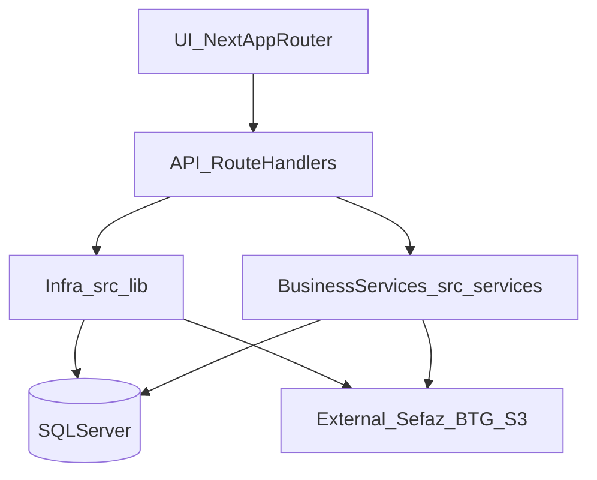

# AuraCore — Project Overview (visão executiva)

## 1) Objetivo deste documento
Este documento consolida uma visão **executiva (gestão + engenharia)** do projeto `aura_core`, cobrindo:
- arquitetura base, módulos e boundaries
- stack e escolhas estruturais
- convenções e padrões adotados
- riscos/dívida técnica e “enterprise readiness”
- pontos críticos específicos de ERP (transações, integridade, fiscal/contábil, multi‑tenancy)

Fonte de verdade de arquitetura (contracts/ADRs/runbooks): `docs/architecture/INDEX.md`.

---

## 2) O que é o AuraCore (produto)
O AuraCore é um ERP/TMS enterprise (Brasil), com módulos: Fiscal (NFe/CTe/MDFe), Financeiro (CP/CR/DDA/CNAB), Contábil (lançamentos), Comercial, Frota, WMS e TMS operacional.

### Status (organização do projeto)
Há dois eixos de documentação:
- **Canônico**: `docs/architecture/*` (contracts, ADRs, diagramas e runbooks)
- **Histórico/execução/planejamento**: `_documentation/*` (ver `_documentation/00_INDICE_MASTER.md`)

---

## 3) Arquitetura base (como o sistema é construído)

### 3.1 Estilo arquitetural
- **Monólito modular** em **Next.js (App Router)**:
  - UI (server/client components) e APIs no mesmo repo
  - rotas em `src/app/(dashboard)/**`
  - endpoints em `src/app/api/**`
- **Infra e “cross‑cutting”** em `src/lib/**`
- **Serviços de negócio/integrações** em `src/services/**`

### 3.2 Camadas (simplificado)

### 3.3 Padrões de design efetivamente usados
**Contratos/ADRs como governança**:
- Contracts: `docs/architecture/contracts/*`
- ADRs: `docs/architecture/adr/*`

**Padrões operacionais** (enterprise):
- **multi‑tenant + branch scoping**: `getTenantContext()` + `x-branch-id` + middleware
- **transações obrigatórias** para fluxos multi‑step (ADR 0005)
- **idempotência persistida no SQL Server** para integrações críticas
- **observabilidade mínima** via logs JSON e endpoints de diagnóstico (Onda 5A)
- **jobs por DB + cron** em pipelines (sem broker dedicado no core)

---

## 4) Estrutura de módulos (mapa para gestão)

### 4.1 Diretórios principais
- `src/app/(dashboard)/**`: telas do produto (protegidas por sessão)
- `src/app/api/**`: rotas API (produto + operacional + público)
- `src/lib/**`: infra (auth, db, observability, idempotency, documents, storage, etc.)
- `src/services/**`: serviços de domínio/integrações (fiscal, btg, banking, etc.)
- `drizzle/` + `drizzle.config.ts`: migrations + config ORM
- `scripts/**`: scripts operacionais (seed, migração, auditorias, correções)
- `docs/architecture/**`: arquitetura canônica
- `_documentation/**`: planejamento + relatórios + trilha histórica

### 4.2 Domínios canônicos
Ver `docs/architecture/domains/*` (ex.: Financeiro/Contábil/Admin/TMS/Auditoria v2/Branch scoping).

---

## 5) Tech Stack (visão de arquitetura)

### 5.1 Backend
- Next.js API Route Handlers (App Router)
- Node runtime (com Edge middleware para políticas transversais)

### 5.2 ORM e DB
- ORM: **Drizzle ORM** (`drizzle-orm`, `drizzle-kit`)
- Banco: **SQL Server 2022** (dialect `mssql`)
- Driver: `mssql` (Tedious)

### 5.3 Cache e mensageria
- Cache distribuído (Redis): **não é padrão hoje**
- Mensageria/broker: **não é padrão hoje**
- Padrão atual de jobs: **SQL + cron** (claim/lock), aplicado em pipelines (ex.: documents).

---

## 6) Convenções de código (o que é esperado em novos códigos)

### 6.1 Contracts e ADRs (obrigatório)
Antes de criar/alterar endpoints críticos, validar:
- `docs/architecture/contracts/API_CONTRACT.md`
- `docs/architecture/contracts/TENANT_BRANCH_CONTRACT.md`
- `docs/architecture/contracts/RBAC_CONTRACT.md`
- `docs/architecture/contracts/ERROR_CONTRACT.md`
- `docs/architecture/contracts/TRANSACTIONS_CONTRACT.md`
- `docs/architecture/contracts/SQLSERVER_PERFORMANCE_CONTRACT.md`

### 6.2 Organização (Next.js)
- UI em `src/app/(dashboard)` e componentes em `src/components`
- APIs em `src/app/api` com `route.ts`
- infra reutilizável em `src/lib`

### 6.3 Validação e consistência de dados
- Zod como contrato de payload em entradas públicas
- Soft delete + optimistic locking quando aplicável (ver `docs/ENTERPRISE_BASE_PATTERN.md`)

### 6.4 Testes
O projeto não tem “suite de testes” como gate central hoje. A estratégia atual combina:
- contracts + ADRs
- smoke checks operacionais (runbooks / ops)
- observabilidade (logs/diagnóstico)

---

## 7) Manutenibilidade (diagnóstico)

### 7.1 Pontos fortes
- Documentação extensa (canônica + histórica)
- Contratos/ADRs claros para segurança/tenancy/transações/performance
- Helpers de infra (transação, idempotência, logs)

### 7.2 Riscos e dívida técnica (itens prioritários)
1) **Build com erros de TS permitido** (`next.config.ts` ignora erros de types) → risco de regressão silenciosa.
2) **Grande volume de rotas** em `src/app/api/**` → risco de inconsistência entre módulos.
3) **Ausência de CI gate unificado** (typecheck/lint/smoke) como requisito para merge.
4) **Scripts operacionais**: úteis, mas precisam de padronização (lint/type safety/execução controlada).
5) **Cache/mensageria**: podem ser necessários conforme escala; hoje depende de SQL+cron e otimizações.

---

## 8) Enterprise readiness (o que já existe e o que falta)

### 8.1 Já existe (alto valor enterprise)
- multi‑tenant + branch scoping
- RBAC relacional (roles/permissions) + contrato
- transações obrigatórias para fluxos críticos (ADR)
- idempotência persistida no SQL (multi‑réplica)
- logs estruturados JSON

### 8.2 Lacunas para maturidade “enterprise”
- enforcement sistemático do `ERROR_CONTRACT` (400/403/503) em todas as rotas críticas
- CI/CD com gates (typecheck/lint/smoke) e rollback definido por onda
- métricas (p95/p99 por endpoint + dados SQL Store) com SLO explícito

---

## 9) Pontos críticos para ERP (checagem de engenharia)

### 9.1 Transações complexas
Contrato: `docs/architecture/contracts/TRANSACTIONS_CONTRACT.md` e ADR `0005`.
Implementação infra: `src/lib/db/mssql-transaction.ts`.

### 9.2 Integridade de dados
Padrões: soft delete, optimistic lock, constraints, transações e idempotência (onde aplicável).

### 9.3 Fiscal/contábil
Há diagramas de estados e sequências em `docs/architecture/diagrams/*` para orientar invariantes.

### 9.4 Multi‑tenancy
Contrato: `docs/architecture/contracts/TENANT_BRANCH_CONTRACT.md`.
Padrão consolidado: `docs/architecture/domains/TENANCY_BRANCH_SCOPING.md`.

---

## 10) Leituras recomendadas (roteiro rápido)
Gestão:
- `_documentation/00_INDICE_MASTER.md`
- `_documentation/planning/ROADMAP_ONDAS_5A_A_9_EXECUTIVO.md`

Arquitetura canônica:
- `docs/architecture/INDEX.md`
- `docs/architecture/contracts/*`
- `docs/architecture/adr/*`

