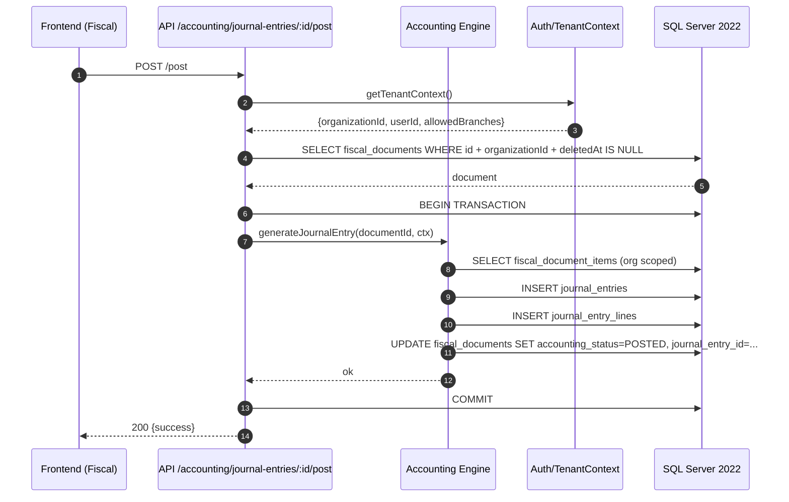

# Sequência — Contábil: Posting de documento fiscal

```mermaid
sequenceDiagram
  autonumber
  participant UI as Frontend (Fiscal)
  participant API as API /accounting/journal-entries/:id/post
  participant ENG as Accounting Engine
  participant AUTH as Auth/TenantContext
  participant DB as SQL Server 2022

  UI->>API: POST /post
  API->>AUTH: getTenantContext()
  AUTH-->>API: {organizationId, userId, allowedBranches}
  API->>DB: SELECT fiscal_documents WHERE id + organizationId + deletedAt IS NULL
  DB-->>API: document

  API->>DB: BEGIN TRANSACTION
  API->>ENG: generateJournalEntry(documentId, ctx)
  ENG->>DB: SELECT fiscal_document_items (org scoped)
  ENG->>DB: INSERT journal_entries
  ENG->>DB: INSERT journal_entry_lines
  ENG->>DB: UPDATE fiscal_documents SET accounting_status=POSTED, journal_entry_id=...
  ENG-->>API: ok
  API->>DB: COMMIT
  API-->>UI: 200 {success}
```
