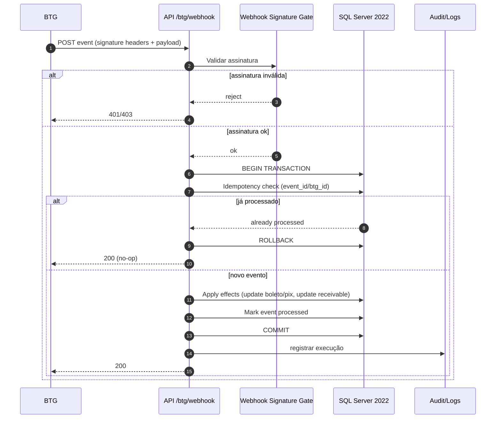

# Sequência — Integração: Webhook BTG (idempotente)

```mermaid
sequenceDiagram
  autonumber
  participant BTG as BTG
  participant API as API /btg/webhook
  participant SEC as Webhook Signature Gate
  participant DB as SQL Server 2022
  participant LOG as Audit/Logs

  BTG->>API: POST event (signature headers + payload)
  API->>SEC: Validar assinatura
  alt assinatura inválida
    SEC-->>API: reject
    API-->>BTG: 401/403
  else assinatura ok
    SEC-->>API: ok
    API->>DB: BEGIN TRANSACTION
    API->>DB: Idempotency check (event_id/btg_id)
    alt já processado
      DB-->>API: already processed
      API->>DB: ROLLBACK
      API-->>BTG: 200 (no-op)
    else novo evento
      API->>DB: Apply effects (update boleto/pix, update receivable)
      API->>DB: Mark event processed
      API->>DB: COMMIT
      API->>LOG: registrar execução
      API-->>BTG: 200
    end
  end
```
