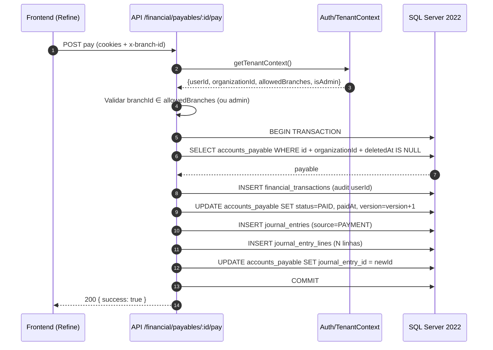

# Sequência — Financeiro: Baixa de Contas a Pagar (com contabilização)

```mermaid
sequenceDiagram
  autonumber
  participant UI as Frontend (Refine)
  participant API as API /financial/payables/:id/pay
  participant AUTH as Auth/TenantContext
  participant DB as SQL Server 2022

  UI->>API: POST pay (cookies + x-branch-id)
  API->>AUTH: getTenantContext()
  AUTH-->>API: {userId, organizationId, allowedBranches, isAdmin}
  API->>API: Validar branchId ∈ allowedBranches (ou admin)
  API->>DB: BEGIN TRANSACTION
  API->>DB: SELECT accounts_payable WHERE id + organizationId + deletedAt IS NULL
  DB-->>API: payable

  API->>DB: INSERT financial_transactions (audit userId)
  API->>DB: UPDATE accounts_payable SET status=PAID, paidAt, version=version+1
  API->>DB: INSERT journal_entries (source=PAYMENT)
  API->>DB: INSERT journal_entry_lines (N linhas)
  API->>DB: UPDATE accounts_payable SET journal_entry_id = newId

  API->>DB: COMMIT
  API-->>UI: 200 { success: true }
```
