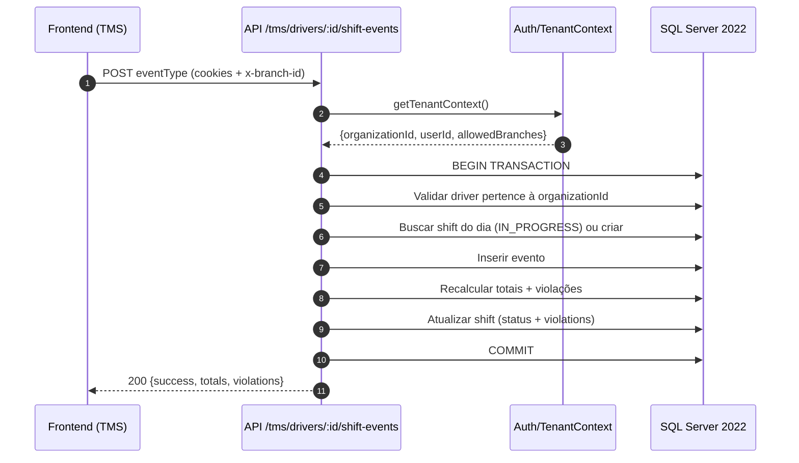

# Sequência — TMS/RH: Evento de jornada do motorista

```mermaid
sequenceDiagram
  autonumber
  participant UI as Frontend (TMS)
  participant API as API /tms/drivers/:id/shift-events
  participant AUTH as Auth/TenantContext
  participant DB as SQL Server 2022

  UI->>API: POST eventType (cookies + x-branch-id)
  API->>AUTH: getTenantContext()
  AUTH-->>API: {organizationId, userId, allowedBranches}

  API->>DB: BEGIN TRANSACTION
  API->>DB: Validar driver pertence à organizationId
  API->>DB: Buscar shift do dia (IN_PROGRESS) ou criar
  API->>DB: Inserir evento
  API->>DB: Recalcular totais + violações
  API->>DB: Atualizar shift (status + violations)
  API->>DB: COMMIT
  API-->>UI: 200 {success, totals, violations}
```
