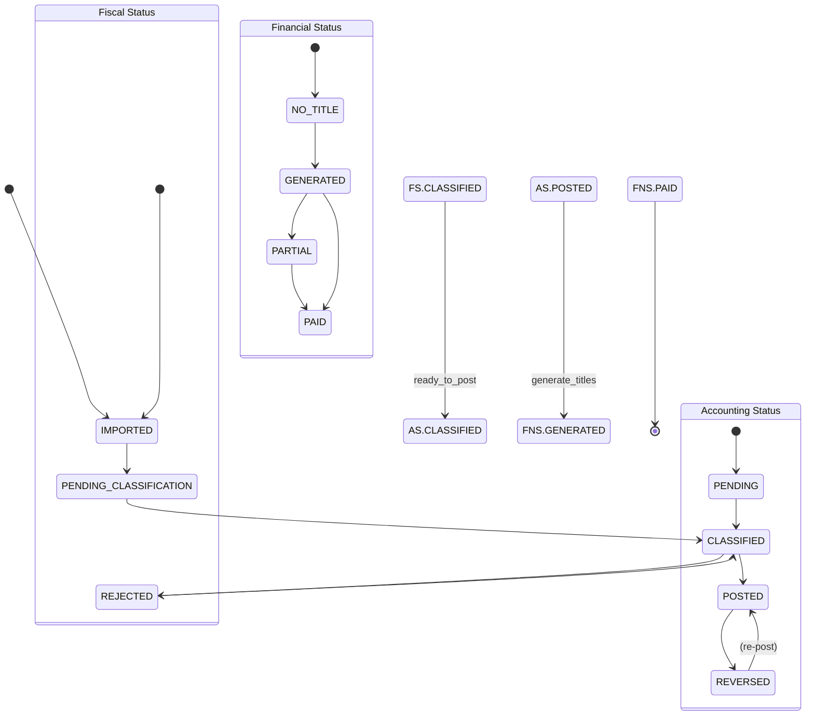

# Estados — Fiscal → Contábil → Financeiro (triple-status)

```mermaid
stateDiagram-v2
  [*] --> IMPORTED

  state "Fiscal Status" as FS {
    [*] --> IMPORTED
    IMPORTED --> PENDING_CLASSIFICATION
    PENDING_CLASSIFICATION --> CLASSIFIED
    CLASSIFIED --> REJECTED
    REJECTED --> CLASSIFIED
  }

  state "Accounting Status" as AS {
    [*] --> PENDING
    PENDING --> CLASSIFIED
    CLASSIFIED --> POSTED
    POSTED --> REVERSED
    REVERSED --> POSTED: (re-post)
  }

  state "Financial Status" as FNS {
    [*] --> NO_TITLE
    NO_TITLE --> GENERATED
    GENERATED --> PARTIAL
    PARTIAL --> PAID
    GENERATED --> PAID
  }

  FS.CLASSIFIED --> AS.CLASSIFIED: ready_to_post
  AS.POSTED --> FNS.GENERATED: generate_titles
  FNS.PAID --> [*]
```
