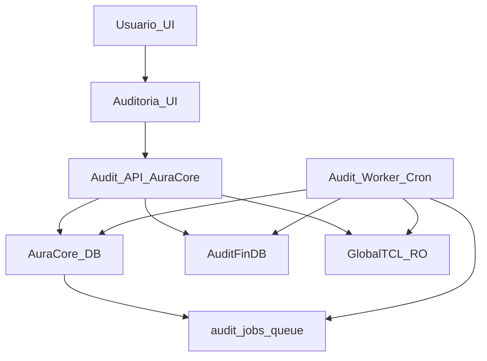

# Domínio — Auditoria interna v2 (GlobalTCL → AuditFinDB)

## 1) Objetivo
Construir um módulo **100% dentro do AuraCore** para auditoria financeira (36 meses), com:
- **Fonte**: `GlobalTCL` (SQL Server) **somente leitura**.
- **Store analítica**: `AuditFinDB` (SQL Server) **read/write** para materialização (snapshots/ETL).
- **Orquestração**: `AuraCore DB` (SQL Server) com **fila de jobs** (assíncrona), segura para multi-réplica.
- **UI**: grids SSRM (Server‑Side Row Model) para grandes volumes.

Princípios:
- **Reprocessamento > migração de dados derivados** (AuditFinDB é “reconstruível” por run).
- **Segurança primeiro**: multi‑tenant + branch scoping + RBAC sempre no backend.
- **Operação enterprise**: idempotência, observabilidade, e execução assíncrona com lock/claim.

---

## 2) Feature flag e configuração (ENV)

### 2.1 Feature flag
- `AUDIT_MODULE_ENABLED` (`true|false`)

### 2.2 Conexões
O módulo usa **dois pools MSSQL** independentes (além do pool do AuraCore DB):
- **Legacy** (GlobalTCL RO): `AUDIT_LEGACY_DB_*`
- **Store** (AuditFinDB RW): `AUDIT_STORE_DB_*`

Formato (para ambos os prefixos):
- `*_SERVER`
- `*_PORT` (default `1433`)
- `*_DATABASE`
- `*_USER`
- `*_PASSWORD`
- `*_ENCRYPT` (`true|false`)
- `*_TRUST_SERVER_CERTIFICATE` (`true|false`)
- `*_SERVERNAME` (SNI; necessário quando `*_SERVER` for IP e `*_ENCRYPT=true`)

Implementação base (já no código):
- `src/lib/audit-v2/env.ts`
- `src/lib/audit-v2/db.ts`

### 2.3 “Enterprise extra” (comportamento desejado)
Para evitar 500 e UX confusa:
1) **Auto‑disable**: se `AUDIT_MODULE_ENABLED=true` mas faltar env crítica, o módulo deve se comportar como **desabilitado** e emitir log claro.
2) **Sem menu quando não configurado**: o front deve **esconder**/desativar entrada do menu com base em um endpoint/flag de configuração.

> Nota: a base atual já faz `enabled=false` + `errors[]` em `getAuditModuleEnv()`. O log claro + ocultação do menu são implementações de PR posterior, mas o comportamento deve ser considerado requisito do domínio.

---

## 3) RBAC (permissões)
Slugs mínimos:
- `audit.read`: acesso às telas (read/SSRM)
- `audit.run`: enfileirar/rodar snapshot
- `audit.migrate`: executar migrações idempotentes no AuditFinDB
- `audit.admin`: operações administrativas (cleanup/retention/reprocess)

Seed (já no repo): `scripts/seed-permissions.ts`.

---

## 4) Arquitetura (visão macro)



### Componentes
- **Audit API (AuraCore)**: endpoints para criar/listar jobs, SSRM, e operação.
- **Audit Worker**: “tick” (cron) que faz claim/lock e executa steps.
- **Audit Store (AuditFinDB)**: tabelas `raw`, `fact` e `findings` por `run_id`.

---

## 5) Modelo de execução (jobs)

### 5.1 Tipos de job (MVP)
- `AUDIT_MIGRATE_SCHEMA`: cria/atualiza schema do AuditFinDB (idempotente).
- `AUDIT_SNAPSHOT_RUN`: executa snapshot/ETL para um período (ex.: 36 meses) e scoping.
- `AUDIT_CLEANUP_RETENTION`: remove dados antigos no AuditFinDB respeitando retenção.

### 5.2 Contrato JSON (envelope comum)
O campo `payload_json` deve seguir um envelope padrão para auditabilidade:

```json
{
  "schemaVersion": 1,
  "jobType": "AUDIT_SNAPSHOT_RUN",
  "requestedBy": {
    "userId": "uuid-string",
    "source": "UI|API|CRON"
  },
  "tenant": {
    "organizationId": 1,
    "branchId": 10
  },
  "idempotencyKey": "audit:org:1:branch:10:snapshot:2025-01-01..2025-12-31",
  "params": {}
}
```

Regras:
- `tenant.organizationId` vem do `getTenantContext()` (nunca do body “livre”).
- `tenant.branchId` é derivado via branch scoping (`x-branch-id` + validação).
- `idempotencyKey` é **obrigatório** para jobs operacionais, para evitar duplicidade em multi‑réplica.

### 5.3 Payloads por jobType

#### A) `AUDIT_MIGRATE_SCHEMA`
```json
{
  "schemaVersion": 1,
  "jobType": "AUDIT_MIGRATE_SCHEMA",
  "requestedBy": { "userId": "uuid-string", "source": "UI" },
  "tenant": { "organizationId": 1, "branchId": 10 },
  "idempotencyKey": "audit:migrate:org:1",
  "params": {
    "targetVersion": 1,
    "dryRun": false
  }
}
```

#### B) `AUDIT_SNAPSHOT_RUN`
```json
{
  "schemaVersion": 1,
  "jobType": "AUDIT_SNAPSHOT_RUN",
  "requestedBy": { "userId": "uuid-string", "source": "UI" },
  "tenant": { "organizationId": 1, "branchId": 10 },
  "idempotencyKey": "audit:snapshot:org:1:branch:10:2023-01-01..2025-12-31",
  "params": {
    "periodStart": "2023-01-01",
    "periodEnd": "2025-12-31",
    "monthsBack": 36,
    "legacyCompanyBranchCode": 123,
    "includeFindings": true,
    "truncateRunIfExists": false
  }
}
```

#### C) `AUDIT_CLEANUP_RETENTION`
```json
{
  "schemaVersion": 1,
  "jobType": "AUDIT_CLEANUP_RETENTION",
  "requestedBy": { "userId": "uuid-string", "source": "CRON" },
  "tenant": { "organizationId": 1, "branchId": 10 },
  "idempotencyKey": "audit:retention:org:1",
  "params": {
    "keepLastRuns": 10,
    "keepDays": 180
  }
}
```

---

## 6) DDL (AuraCore DB) — fila de jobs e steps

### 6.1 `dbo.audit_jobs`
Requisitos:
- multi‑tenant (`organization_id`), opcionalmente scoping de filial (`branch_id`)
- execução idempotente (chave opcional, mas fortemente recomendada)
- suporte a reexecução, backoff, e reaper de jobs “stale”

```sql
IF OBJECT_ID(N'dbo.audit_jobs', N'U') IS NULL
BEGIN
  CREATE TABLE dbo.audit_jobs (
    job_id UNIQUEIDENTIFIER NOT NULL CONSTRAINT PK_audit_jobs PRIMARY KEY,

    organization_id INT NOT NULL,
    branch_id INT NULL,

    job_type NVARCHAR(64) NOT NULL,
    status NVARCHAR(32) NOT NULL, -- QUEUED|RUNNING|SUCCEEDED|FAILED|CANCELLED

    payload_json NVARCHAR(MAX) NOT NULL,
    idempotency_key NVARCHAR(200) NULL,

    priority INT NOT NULL CONSTRAINT DF_audit_jobs_priority DEFAULT (100),
    attempts INT NOT NULL CONSTRAINT DF_audit_jobs_attempts DEFAULT (0),
    max_attempts INT NOT NULL CONSTRAINT DF_audit_jobs_max_attempts DEFAULT (5),

    next_run_at DATETIME2 NOT NULL CONSTRAINT DF_audit_jobs_next_run_at DEFAULT (SYSUTCDATETIME()),

    locked_at DATETIME2 NULL,
    locked_by NVARCHAR(128) NULL,

    started_at DATETIME2 NULL,
    finished_at DATETIME2 NULL,

    last_error NVARCHAR(MAX) NULL,

    created_at DATETIME2 NOT NULL CONSTRAINT DF_audit_jobs_created_at DEFAULT (SYSUTCDATETIME()),
    created_by_user_id NVARCHAR(64) NULL,
    updated_at DATETIME2 NOT NULL CONSTRAINT DF_audit_jobs_updated_at DEFAULT (SYSUTCDATETIME())
  );
END
GO

-- ISJSON para evitar payload inválido
IF NOT EXISTS (
  SELECT 1 FROM sys.check_constraints WHERE name = N'CK_audit_jobs_payload_isjson'
)
BEGIN
  ALTER TABLE dbo.audit_jobs
    ADD CONSTRAINT CK_audit_jobs_payload_isjson CHECK (ISJSON(payload_json) = 1);
END
GO

-- Idempotência (opcional mas recomendada)
IF NOT EXISTS (
  SELECT 1 FROM sys.indexes WHERE name = N'UX_audit_jobs_idempotency' AND object_id = OBJECT_ID(N'dbo.audit_jobs')
)
BEGIN
  CREATE UNIQUE INDEX UX_audit_jobs_idempotency
    ON dbo.audit_jobs (organization_id, idempotency_key)
    WHERE idempotency_key IS NOT NULL;
END
GO

-- Índices para claim eficiente
IF NOT EXISTS (
  SELECT 1 FROM sys.indexes WHERE name = N'IX_audit_jobs_claim' AND object_id = OBJECT_ID(N'dbo.audit_jobs')
)
BEGIN
  CREATE INDEX IX_audit_jobs_claim
    ON dbo.audit_jobs (status, next_run_at, priority, created_at)
    INCLUDE (organization_id, branch_id, job_type, attempts);
END
GO
```

### 6.2 `dbo.audit_job_steps`
Tabela para rastrear steps e facilitar debug (e SSRM de execução).

```sql
IF OBJECT_ID(N'dbo.audit_job_steps', N'U') IS NULL
BEGIN
  CREATE TABLE dbo.audit_job_steps (
    step_id BIGINT IDENTITY(1,1) NOT NULL CONSTRAINT PK_audit_job_steps PRIMARY KEY,
    job_id UNIQUEIDENTIFIER NOT NULL,

    step_key NVARCHAR(64) NOT NULL, -- EXTRACT|RAW_INSERT|TRANSFORM|FINDINGS|FINALIZE...
    status NVARCHAR(32) NOT NULL,   -- STARTED|SUCCEEDED|FAILED|SKIPPED

    started_at DATETIME2 NOT NULL CONSTRAINT DF_audit_job_steps_started_at DEFAULT (SYSUTCDATETIME()),
    finished_at DATETIME2 NULL,

    message NVARCHAR(4000) NULL,
    metrics_json NVARCHAR(MAX) NULL,

    CONSTRAINT FK_audit_job_steps_job
      FOREIGN KEY (job_id) REFERENCES dbo.audit_jobs(job_id)
      ON DELETE CASCADE
  );
END
GO

IF NOT EXISTS (
  SELECT 1 FROM sys.indexes WHERE name = N'IX_audit_job_steps_job' AND object_id = OBJECT_ID(N'dbo.audit_job_steps')
)
BEGIN
  CREATE INDEX IX_audit_job_steps_job
    ON dbo.audit_job_steps (job_id, step_id);
END
GO
```

---

## 7) Protocolo claim/lock (SQL Server) — multi‑réplica
Objetivo: permitir que múltiplas réplicas/instâncias executem jobs sem duplicidade.

### 7.1 Claim “atômico”
Padrão recomendado (pseudo‑SQL):

```sql
DECLARE @now DATETIME2 = SYSUTCDATETIME();

;WITH cte AS (
  SELECT TOP (1) job_id
  FROM dbo.audit_jobs WITH (UPDLOCK, READPAST, ROWLOCK)
  WHERE status = N'QUEUED'
    AND next_run_at <= @now
  ORDER BY priority ASC, created_at ASC
)
UPDATE j
SET
  status = N'RUNNING',
  locked_at = @now,
  locked_by = @workerId,
  started_at = COALESCE(started_at, @now),
  updated_at = @now
OUTPUT INSERTED.*
FROM dbo.audit_jobs j
INNER JOIN cte ON cte.job_id = j.job_id;
```

Notas:
- `READPAST` evita bloquear worker em jobs já lockados.
- `UPDLOCK` garante exclusividade durante o claim.
- `ROWLOCK` força lock de linha (melhor para filas).

### 7.2 Reaper de jobs “stale”
Se `RUNNING` ficar preso (redeploy/crash), reprocessar após tolerância:
- critério: `status=RUNNING AND locked_at < now - X minutes`
- ação: setar `status=QUEUED`, `locked_at=NULL`, `locked_by=NULL`, e `next_run_at=now` (ou backoff)

---

## 8) Contrato de erros (HTTP)
Referência canônica: `docs/architecture/contracts/ERROR_CONTRACT.md`.

Regras específicas do domínio Auditoria v2:
- Se `AUDIT_MODULE_ENABLED=false` ou env inválida → responder **503** com payload padronizado.
- Se payload inválido (schema) → **400**.
- Se sem permissão (`audit.*`) → **403**.

---

## 9) Faseamento MVP (roadmap executável)

### MVP‑0 (base)
- ENV/pools separados (`src/lib/audit-v2/*`)
- RBAC `audit.*` no seed

### MVP‑1 (fila)
- migration DDL: `audit_jobs` + `audit_job_steps`
- worker tick (cron) + claim/lock + reaper

### MVP‑2 (migração do AuditFinDB)
- job `AUDIT_MIGRATE_SCHEMA` idempotente

### MVP‑3 (snapshot)
- job `AUDIT_SNAPSHOT_RUN` (extract → raw → facts → findings)

### MVP‑4 (UI SSRM)
- telas mínimas: jobs/runs + SSRM para parcelas/findings (conforme modelagem do AuditFinDB)

---

## 10) Métricas / benchmarks (mínimo)
- **Tempo de snapshot** (P50/P95) por período/filial
- **Linhas extraídas** (raw) e linhas materializadas (facts/findings)
- **Taxa de falhas** por jobType
- **Tempo de claim** e fila acumulada (`QUEUED` > 0)
- **Queries SSRM**: P95 de latência por grid, com page size padrão

