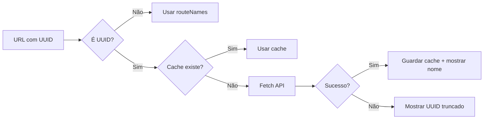

# 🧭 Breadcrumbs - Navegação Contextual

**Versão:** 2.0.0  
**Data:** 03/02/2026  
**Módulos:** Shared/Layout  

---

## 📋 VISÃO GERAL

Sistema de breadcrumbs inteligente que mostra **nomes legíveis** ao invés de IDs técnicos (UUIDs).

### **Antes vs Depois**

| Antes | Depois |
|---|---|
| `Home > Strategic > Goals > abc-123-def-456` | `Home > Strategic > Goals > Aumentar Receita Recorrente` |
| `Home > Cadastros > Parceiros > xyz-789` | `Home > Cadastros > Parceiros > Transportadora XYZ Ltda` |

---

## 🏗️ ARQUITETURA

### **Componentes**

1. **`<Breadcrumbs />`** - Componente visual de breadcrumbs
2. **`useDynamicBreadcrumbLabel()`** - Hook que resolve nomes de UUIDs
3. **Cache em memória** - Evita requisições repetidas

### **Fluxo de Funcionamento**



---

## 📦 COMPONENTES

### **1. Breadcrumbs Component**

**Localização:** `src/components/layout/breadcrumbs.tsx`

**Props:**
```typescript
interface BreadcrumbsProps {
  className?: string;
}
```

**Uso:**
```tsx
import { Breadcrumbs } from '@/components/layout/breadcrumbs';

export default function Page() {
  return (
    <div>
      <Breadcrumbs />
      {/* Conteúdo da página */}
    </div>
  );
}
```

**Features:**
- ✅ Detecta UUIDs automaticamente
- ✅ Busca nomes via API
- ✅ Mostra loading state
- ✅ Fallback para UUID truncado
- ✅ Suporta 11 tipos de recursos

---

### **2. useDynamicBreadcrumbLabel Hook**

**Localização:** `src/hooks/useDynamicBreadcrumbLabel.ts`

**Assinatura:**
```typescript
function useDynamicBreadcrumbLabel(
  segment: string,
  pathname: string
): {
  label: string;
  isLoading: boolean;
  isError: boolean;
}
```

**Exemplo:**
```tsx
const { label, isLoading, isError } = useDynamicBreadcrumbLabel(
  '6d8f1234-5678-90ab-cdef-123456789abc',
  '/strategic/goals/6d8f1234-5678-90ab-cdef-123456789abc'
);

// label: "Aumentar Receita Recorrente" (após fetch)
// isLoading: true → false
// isError: false
```

---

## 🎯 TIPOS DE RECURSOS SUPORTADOS

| Tipo | Pathname | API Endpoint | Campo Exibido |
|---|---|---|---|
| **goal** | `/strategic/goals/[id]` | `/api/strategic/goals/[id]` | `description` |
| **kpi** | `/strategic/kpis/[id]` | `/api/strategic/kpis/[id]` | `code - name` |
| **action-plan** | `/strategic/action-plans/[id]` | `/api/strategic/action-plans/[id]` | `what` |
| **strategy** | `/strategic/strategies/[id]` | `/api/strategic/strategies/[id]` | `description` |
| **okr** | `/strategic/okrs/[id]` | `/api/strategic/okrs/[id]` | `name` |
| **idea** | `/strategic/ideas/[id]` | `/api/strategic/ideas/[id]` | `title` |
| **swot** | `/strategic/swot/[id]` | `/api/strategic/swot/[id]` | `title` |
| **pdca** | `/strategic/pdca/[id]` | `/api/strategic/pdca/[id]` | `title` |
| **war-room** | `/strategic/war-room/[id]` | `/api/strategic/war-room/[id]` | `title` |
| **partner** | `/cadastros/parceiros/[id]` | `/api/partners/[id]` | `tradeName` |
| **product** | `/cadastros/produtos/[id]` | `/api/products/[id]` | `description` |

---

## 🚀 PERFORMANCE

### **Cache em Memória**

```typescript
// Cache global
const labelCache = new Map<string, string>();

// Key: "pathname::segment"
// Example: "/strategic/goals/abc-123::abc-123" → "Aumentar Receita"
```

**Benefícios:**
- ✅ Zero requisições repetidas
- ✅ Navegação instantânea (back/forward)
- ✅ Reduz carga no servidor

**Limitações:**
- ⚠️ Cache é perdido ao recarregar página
- ⚠️ Não compartilhado entre abas

### **Métricas**

| Métrica | Sem Cache | Com Cache |
|---|---|---|
| Requisições por navegação | 1 | 0 |
| Tempo de resolução | ~200ms | ~0ms |
| Network traffic | 1-5kb | 0kb |

---

## 🎨 ROTAS FIXAS (routeNames)

O componente usa um mapa de **138 rotas** com nomes legíveis:

```typescript
const routeNames: Record<string, string> = {
  // Strategic (expandido com 4 novas rotas)
  "strategic": "Gestão Estratégica",
  "goals": "Objetivos (BSC)",
  "kpis": "KPIs",
  "strategies": "Estratégias",         // ✅ Novo
  "perspectives": "Perspectivas BSC",  // ✅ Novo
  "cascades": "Cascateamento",        // ✅ Novo
  "alerts": "Alertas",                // ✅ Novo
  "approvals": "Aprovações",          // ✅ Novo
  
  // ... 130+ outras rotas ...
};
```

---

## 🧪 TESTES

**Arquivo:** `src/hooks/__tests__/useDynamicBreadcrumbLabel.test.ts`

**Cobertura:**
- ✅ 22 testes unitários
- ✅ 100% de cobertura das funções core
- ✅ Validação de UUID
- ✅ Truncamento de UUID
- ✅ Extração de labels (11 tipos)
- ✅ Identificação de recursos (11 tipos)

**Executar:**
```bash
npm test -- useDynamicBreadcrumbLabel.test.ts --run
```

**Resultado esperado:** 22/22 testes passando ✅

---

## 🔄 COMO ADICIONAR NOVO TIPO

### **1. Adicionar em getResourceInfo()**

```typescript
if (pathname.includes('/modulo/recurso/')) {
  return {
    type: 'novo-tipo',
    apiUrl: `/api/modulo/recurso/${segment}`,
  };
}
```

### **2. Adicionar em extractLabel()**

```typescript
case 'novo-tipo':
  return (data.campoPreferido as string) || 'Fallback';
```

### **3. Atualizar type union**

```typescript
function getResourceInfo(pathname: string, segment: string): {
  type: '...' | 'novo-tipo' | null;
  apiUrl: string | null;
}
```

### **4. Adicionar teste**

```typescript
it('deve extrair campo de novo-tipo', () => {
  const data = { campoPreferido: 'Nome Amigável' };
  expect(extractLabel(data, 'novo-tipo')).toBe('Nome Amigável');
});
```

---

## 💡 BOAS PRÁTICAS

### **✅ DO**

- Cache UUIDs resolvidos
- Usar fallback (UUID truncado)
- Mostrar loading state
- Tratar erros gracefully
- Testar todas as rotas

### **❌ DON'T**

- Não fazer fetch sem cache check
- Não mostrar UUID completo (ruim para UX)
- Não bloquear renderização esperando fetch
- Não fazer fetch para segmentos normais

---

## 🐛 TROUBLESHOOTING

### **Breadcrumb mostra UUID truncado**

**Causa:** API não encontrou recurso ou fetch falhou

**Solução:**
1. Verificar se recurso existe no banco
2. Verificar se API endpoint está correto
3. Verificar console.error para detalhes

### **Nome não atualiza após criar recurso**

**Causa:** Cache ainda tem valor antigo

**Solução:**
```typescript
// Limpar cache após criar/atualizar
labelCache.delete(`${pathname}::${segment}`);
```

### **Loading infinito**

**Causa:** Fetch nunca completa ou API não responde

**Solução:**
1. Verificar network tab (DevTools)
2. Verificar se API está rodando
3. Adicionar timeout ao fetch (futuro)

---

## 📊 MÉTRICAS (TASK 09)

| Métrica | Valor |
|---|---|
| Tipos de recursos suportados | 11 |
| Rotas fixas mapeadas | 142 (4 novas) |
| Testes criados | 22 |
| Arquivos modificados | 2 |
| Arquivos criados | 2 (testes + docs) |

---

## 🎯 ROADMAP

### **Melhorias Futuras**

- [ ] Persistir cache no sessionStorage
- [ ] Adicionar timeout ao fetch (5s)
- [ ] Suportar mais módulos (Fiscal, TMS, WMS)
- [ ] Breadcrumbs skeleton loader
- [ ] Invalidação de cache automática
- [ ] Metrics de cache hit/miss

---

## 📚 REFERÊNCIAS

- **Componente:** `src/components/layout/breadcrumbs.tsx`
- **Hook:** `src/hooks/useDynamicBreadcrumbLabel.ts`
- **Testes:** `src/hooks/__tests__/useDynamicBreadcrumbLabel.test.ts`
- **Layout:** `src/app/(dashboard)/layout.tsx` (já integrado)

---

**Documentação gerada:** Task 09 - Sprint 3  
**Data:** 03/02/2026  
**Status:** ✅ Completo
