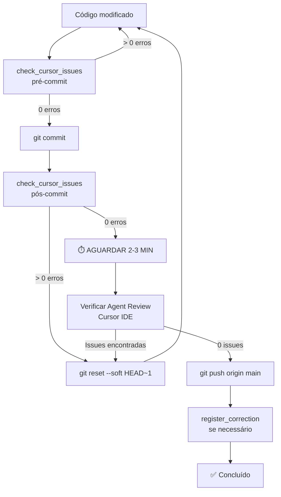

# AuraCore - Sistema de Qualidade e Aprendizado Contínuo

## Versão: 1.0.0
## Data: 27/12/2025

---

## 1. VISÃO GERAL

O AuraCore possui um sistema integrado de qualidade baseado em MCP (Model Context Protocol) que:
- Valida código automaticamente antes/depois de commits
- Registra correções como regras permanentes
- Impede reincidência de erros conhecidos
- Aprende continuamente com cada correção

---

## 2. ARQUITETURA MCP

### 2.1 Localização
```
mcp-server/
├── src/
│   ├── server.ts              # Servidor principal
│   ├── index.ts               # Entry point
│   └── tools/
│       ├── check-cursor-issues.ts    # Verificação tsc + eslint
│       ├── register-correction.ts    # Registro de correções
│       ├── validate-code.ts          # Validação contra contratos
│       ├── check-compliance.ts       # Compliance de arquivo
│       ├── get-epic-status.ts        # Status de épicos
│       ├── get-contract-tool.ts      # Buscar contrato
│       ├── search-patterns.ts        # Buscar padrões
│       └── propose-pattern.ts        # Propor padrão
├── knowledge/
│   ├── contracts/             # Contratos arquiteturais
│   ├── patterns/
│   │   ├── approved/          # Padrões aprovados
│   │   └── proposed/          # Padrões em avaliação
│   ├── corrections/           # Histórico de correções
│   ├── adrs/                  # Architecture Decision Records
│   └── epics/                 # Status dos épicos
└── dist/                      # Código compilado
```

### 2.2 Configuração Cursor
```json
// ~/.cursor/mcp.json
{
  "mcpServers": {
    "auracore-knowledge": {
      "command": "node",
      "args": ["/Users/pedrolemes/aura_core/mcp-server/dist/index.js"],
      "env": {
        "NODE_ENV": "production"
      }
    }
  }
}
```

---

## 3. TOOLS DISPONÍVEIS (9)

### 3.1 Verificação e Validação

| Tool | Função | Quando Usar |
|------|--------|-------------|
| `check_cursor_issues` | Executa tsc + eslint | Antes/depois de commits |
| `validate_code` | Valida código contra contratos | Durante desenvolvimento |
| `check_compliance` | Verifica compliance de arquivo | Revisão de código |

### 3.2 Consulta de Conhecimento

| Tool | Função | Quando Usar |
|------|--------|-------------|
| `get_contract` | Retorna contrato completo | Antes de codificar |
| `search_patterns` | Busca padrões aprovados | Antes de codificar |
| `get_epic_status` | Status de épico | Planejamento |

### 3.3 Registro e Proposta

| Tool | Função | Quando Usar |
|------|--------|-------------|
| `register_correction` | Registra correção permanente | Após corrigir issue |
| `propose_pattern` | Propõe novo padrão | Quando identificar padrão útil |

### 3.4 Utilitários

| Tool | Função | Quando Usar |
|------|--------|-------------|
| `ping` | Teste de conexão | Debug |

---

## 4. CONTRATOS DISPONÍVEIS (12)

| Contrato | Categoria | Descrição |
|----------|-----------|-----------|
| `type-safety` | TypeScript | Regras de tipagem (VIVO - atualiza automaticamente) |
| `api-contract` | API | Regras para Route Handlers |
| `tenant-branch-contract` | Multi-tenancy | Regras de tenant + branch |
| `transactions-contract` | SQL | Regras de transações |
| `error-contract` | Erros | Padrões de erro HTTP |
| `rbac-contract` | Segurança | Regras de permissão |
| `sqlserver-performance-contract` | Performance | Regras de performance SQL |
| `verify-before-code` | Processo | Verificação obrigatória antes de codificar (Lessons #5,6,9,11,12) |
| `code-consistency` | Qualidade | Padrões consistentes (Lessons #3,4,7,10,15,16) |
| `error-handling` | Erros | Tratamento de erros (Lessons #8,13) |
| `security` | Segurança | Proteção contra vulnerabilidades (Lessons #1,14) |
| `sped-contract` | Fiscal | Regras específicas para SPED (E7.13) |

### 4.1 Mapeamento Lessons Learned → Contratos

As 16 Lessons Learned (registradas em `docs/mcp/LESSONS_LEARNED.md`) foram consolidadas em 22 regras ENFORCE distribuídas em 5 novos contratos:

| Lesson | Descrição | Contrato | Regra |
|--------|-----------|----------|-------|
| #1 | Path Traversal Protection | security | ENFORCE-055 |
| #3 | Type Safety - Forbidden any | code-consistency | ENFORCE-040 |
| #4 | Array Safety | code-consistency | ENFORCE-041 |
| #5 | Property Access Safety | verify-before-code | ENFORCE-030 |
| #6 | Schema Validation | verify-before-code | ENFORCE-031 |
| #7 | MIME Types Consistency | code-consistency | ENFORCE-042 |
| #8 | Error Handling | error-handling | ENFORCE-050 |
| #9 | Type Guards | verify-before-code | ENFORCE-032 |
| #10 | Promise Handling | code-consistency | ENFORCE-043 |
| #11 | Schema Consistency | verify-before-code | ENFORCE-033 |
| #12 | Type Assertions | verify-before-code | ENFORCE-034 |
| #13 | Re-throw Unknown | error-handling | ENFORCE-051 |
| #14 | Regex Specificity | security | ENFORCE-056 |
| #15 | Array Element Validation | code-consistency | ENFORCE-044 |
| #16 | String Non-Empty | code-consistency | ENFORCE-045 |

**Origem:**
- 15 regras das Lessons Learned #1-16 (exceto #2: específica demais - tsc stdout vs stderr)
- 7 regras dos bugs E7.13 (SPED, encoding, source_type, etc)
- **Total: 22 regras ENFORCE** (ENFORCE-030 a ENFORCE-067)

---

## 5. FLUXO DE QUALIDADE

### 5.1 Fluxo de Commit (OBRIGATÓRIO)
```
1. Codificar alterações
         │
         ▼
2. check_cursor_issues (pré-commit)
         │
         ├── Issues? → Corrigir → Voltar ao 2
         │
         ▼
3. git commit -m "mensagem"
         │
         ▼
4. check_cursor_issues (pós-commit)
         │
         ├── Issues? → Corrigir + register_correction → Novo commit → Voltar ao 4
         │
         ▼
5. git push origin main ✅
```

### 5.2 Fluxo de Desenvolvimento (RECOMENDADO)
```
1. Receber tarefa
         │
         ▼
2. Consultar MCP:
   - get_contract("tipo-relevante")
   - search_patterns("tema")
         │
         ▼
3. Codificar seguindo contratos e padrões
         │
         ▼
4. validate_code no código criado
         │
         ├── Violações? → Corrigir → Voltar ao 4
         │
         ▼
5. Seguir Fluxo de Commit (5.1)
```

---

## 6. SISTEMA DE APRENDIZADO

### 6.1 Como Funciona
```
Erro encontrado
      │
      ▼
Erro corrigido
      │
      ▼
register_correction({
  epic: "E2",
  error_description: "Descrição do erro",
  correction_applied: "Como foi corrigido",
  files_affected: ["arquivo.ts"],
  pattern_name: "nome-do-padrao"
})
      │
      ├──► Salva em corrections/{epic}-corrections.json
      │
      └──► Atualiza type-safety.json (learned_corrections)
             │
             ▼
      validate_code BLOQUEIA este erro em futuros commits
```

### 6.2 Correções Registradas

| ID | Épico | Erro | Padrão Criado |
|----|-------|------|---------------|
| LC-001 | E0.1 | result[0] any implícito | sql-query-typing |
| LC-002 | E0.1 | catch (error: any) | error-handling-unknown |
| LC-677308 | MCP | path traversal | input-sanitization |

---

## 7. ÉPICOS E PROGRESSO

| Épico | Nome | Status | Resultado |
|-------|------|--------|-----------|
| E0.1 | Eliminar any implícito SQL | ✅ COMPLETO | 38 any eliminados |
| E2 | Tipar rotas API | 🔄 PRÓXIMO | - |
| E9 | Arquivos críticos (com testes) | ⏳ FUTURO | - |

---

## 8. ARQUIVOS CRÍTICOS (NÃO TOCAR SEM TESTES)

| Arquivo | Motivo | Risco |
|---------|--------|-------|
| accounting-engine.ts | Contabilização | Multa R$ 5.000+ |
| financial-title-generator.ts | Títulos financeiros | Multa R$ 5.000+ |
| sped-fiscal-generator.ts | SPED Fiscal | Multa R$ 5.000+ |
| sped-ecd-generator.ts | SPED Contábil | Multa R$ 5.000+ |
| sped-contributions-generator.ts | SPED PIS/COFINS | Multa R$ 5.000+ |

---

## 9. REGRAS OBRIGATÓRIAS PARA AGENTES

### 9.1 Antes de Codificar
```
Tool: get_contract
Args: { "contract_id": "type-safety" }

Tool: search_patterns
Args: { "query": "[tema relevante]" }
```

### 9.2 Fluxo de Commit
```
1. check_cursor_issues (pré-commit)
2. Se issues = 0: commit
3. check_cursor_issues (pós-commit)
4. Se issues = 0: push
5. Se issues > 0: corrigir + register_correction + repetir
```

### 9.3 Regras de Código

- ❌ NUNCA use `any` (use `unknown` ou tipo específico)
- ❌ NUNCA use `@ts-ignore` ou `as any`
- ✅ SEMPRE crie interfaces para resultados SQL
- ✅ SEMPRE valide existência antes de acessar propriedades
- ✅ SEMPRE use type guards com `unknown`
- ✅ SEMPRE use Zod para validação de input em APIs

### 9.4 Relatório Final Obrigatório
```markdown
## TAREFA CONCLUÍDA

### Verificações MCP
- check_cursor_issues (pré-commit): ✅/❌
- check_cursor_issues (pós-commit): ✅/❌

### Commits
- Hash: [hash]
- Mensagem: [mensagem]

### Push
- Status: ✅ Realizado / ⏳ Pendente

### Correções Registradas
- [LC-XXXXX]: [descrição] (se houver)
```

---

## 10. COMANDOS ÚTEIS

### MCP Server
```bash
# Rebuild após alterações
cd mcp-server && npm run build

# Verificar se está funcionando
# (verificar ponto verde em Cursor > Settings > Tools & MCP)
```

### Verificação Manual
```bash
# TypeScript
npx tsc --noEmit 2>&1 | grep "error TS" | head -20

# ESLint
npm run lint 2>&1 | grep "error" | head -20

# Contagem de erros
npx tsc --noEmit 2>&1 | grep -c "error TS"
```

---

## 11. TROUBLESHOOTING

### MCP não conecta (ponto vermelho)
1. Verificar se dist/index.js existe: `ls mcp-server/dist/index.js`
2. Rebuild: `cd mcp-server && npm run build`
3. Reiniciar Cursor (Cmd+Q e reabrir)

### Tool não funciona
1. Verificar logs do Cursor
2. Testar tool manualmente no chat
3. Verificar se arquivo .ts foi compilado para .js

### Correção não registrada
1. Verificar se type-safety.json foi atualizado
2. Verificar se corrections/{epic}-corrections.json existe
3. Rebuild MCP Server

---

## 12. PREVENÇÃO DE REGRESSÕES (CRÍTICO) 🚨

### 12.1 Após Scripts de Automação

**SEMPRE** seguir este checklist após executar scripts que modificam múltiplos arquivos:

```bash
# 1. Contar erros ANTES
ANTES=$(npx tsc --noEmit --incremental false 2>&1 | grep -c "error TS")
echo "⏱️  Erros antes: $ANTES"

# 2. Executar script
npx tsx scripts/seu-script.ts

# 3. Contar erros DEPOIS
DEPOIS=$(npx tsc --noEmit --incremental false 2>&1 | grep -c "error TS")
echo "⏱️  Erros depois: $DEPOIS"

# 4. Verificar se padrão antigo ainda existe
PADRÃO_ANTIGO=$(grep -rn "PADRÃO_ANTIGO" src --include="*.ts" | wc -l)
echo "🔍 Padrão antigo restante: $PADRÃO_ANTIGO"

# 5. Decidir
if [ $DEPOIS -gt $ANTES ]; then
  echo "❌ REGRESSÃO DETECTADA! Não fazer commit."
  echo "   Erros aumentaram de $ANTES para $DEPOIS (+$((DEPOIS - ANTES)))"
  git checkout .
  exit 1
elif [ $PADRÃO_ANTIGO -gt 0 ]; then
  echo "⚠️  ATENÇÃO: Script incompleto! Padrão antigo ainda existe."
  echo "   Revisar script antes de commit."
  exit 1
else
  echo "✅ OK para commit (erros: $ANTES → $DEPOIS)"
fi
```

### 12.2 Lição Aprendida: E2 BATCH 1 → Regressão TS18046

#### O que aconteceu

| Fase | Ação | Resultado | Problema |
|------|------|-----------|----------|
| 1. E2 BATCH 1 | Script substituiu `catch (error: any)` → `catch (error: unknown)` | ✅ 269 substituições | - |
| 2. E2 BATCH 1 | Script criou `const errorMessage = ...` | ✅ 269 criações | - |
| 3. E2 BATCH 1 | Script substituiu `error.message` → `errorMessage` | ❌ **PARCIAL** (apenas 179/412) | **233 erros TS18046** |
| 4. E2 BATCH 1 | check_cursor_issues executado | ❌ **Não detectou** | tsc estava cacheado |
| 5. E2 BATCH 1 | Commit + Push realizado | ✅ Sucesso | **Regressão passou despercebida** |
| 6. E3 BATCH 3 | Verificação manual pós-E2 | ⚠️ **233 erros TS18046** descobertos | Necessário BATCH 3 |
| 7. E3 BATCH 3 | Script melhorado executado | ✅ 179 correções | 79 erros inline restantes |

#### Por que aconteceu

| Causa | Detalhes | Impacto |
|-------|----------|---------|
| **Regex incompleta** | Script não capturou `error.message` em contextos inline como `{ error: error.message }` | 233 erros não corrigidos |
| **tsc cacheado** | `check_cursor_issues` usou `tsc --noEmit` (com cache incremental) | Erros TS18046 não detectados |
| **Falta de verificação** | Não verificou se padrão antigo (`error.message`) ainda existia | Script passou como "sucesso" |
| **Commit imediato** | Commit realizado sem comparação de erros antes/depois | Regressão enviada ao repositório |

#### Como prevenir

| Etapa | Ação | Comando/Tool | Objetivo |
|-------|------|--------------|----------|
| **1. Antes do script** | Contar erros TypeScript | `npx tsc --noEmit --incremental false 2>&1 \| grep -c "error TS"` | Baseline |
| **2. Após script** | Contar erros novamente | Mesmo comando | Comparação |
| **3. Verificar padrão** | Buscar padrão antigo | `grep -rn "error\\.message" src \| wc -l` | Completude |
| **4. Validar resultado** | Se erros aumentaram | `git checkout .` | Cancelar mudanças |
| **5. MCP check** | `check_cursor_issues` com `--incremental false` | Tool MCP | Verificação final |
| **6. Commit** | Só se erros <= baseline | `git commit` | Segurança |

#### Checklist Obrigatório para Scripts de Automação

```bash
#!/bin/bash
# Template de verificação pós-script

# Cores
RED='\033[0;31m'
GREEN='\033[0;32m'
YELLOW='\033[1;33m'
NC='\033[0m' # No Color

echo "🔍 VERIFICAÇÃO PÓS-SCRIPT"
echo "========================="

# 1. Contar erros ANTES (se disponível em variável de ambiente)
if [ -z "$ERRORS_BEFORE" ]; then
  echo "${YELLOW}⚠️  ERRORS_BEFORE não definido. Execute script com:${NC}"
  echo "   export ERRORS_BEFORE=\$(npx tsc --noEmit --incremental false 2>&1 | grep -c 'error TS')"
  exit 1
fi

# 2. Contar erros DEPOIS
ERRORS_AFTER=$(npx tsc --noEmit --incremental false 2>&1 | grep -c "error TS")

# 3. Verificar padrão antigo (exemplo: error.message)
OLD_PATTERN_COUNT=$(grep -rn "error\.message" src --include="*.ts" 2>/dev/null | wc -l | tr -d ' ')

# 4. Calcular diferença
DIFF=$((ERRORS_AFTER - ERRORS_BEFORE))

# 5. Relatório
echo ""
echo "📊 RESULTADOS:"
echo "   Erros antes:  $ERRORS_BEFORE"
echo "   Erros depois: $ERRORS_AFTER"
echo "   Diferença:    $DIFF"
echo "   Padrão antigo: $OLD_PATTERN_COUNT ocorrências"
echo ""

# 6. Decisão
if [ $DIFF -gt 0 ]; then
  echo "${RED}❌ REGRESSÃO DETECTADA!${NC}"
  echo "   Erros aumentaram em $DIFF"
  echo "   Executando git checkout ..."
  git checkout .
  exit 1
elif [ $OLD_PATTERN_COUNT -gt 0 ]; then
  echo "${YELLOW}⚠️  ATENÇÃO: Script incompleto!${NC}"
  echo "   Padrão antigo ainda existe em $OLD_PATTERN_COUNT locais"
  echo "   Revisar e melhorar script antes de commit."
  exit 1
elif [ $DIFF -lt 0 ]; then
  echo "${GREEN}✅ EXCELENTE! Erros reduziram em ${DIFF#-}${NC}"
  echo "   OK para commit."
  exit 0
else
  echo "${GREEN}✅ OK para commit (sem mudanças)${NC}"
  exit 0
fi
```

### 12.3 Casos de Uso

#### Exemplo 1: Script de Substituição de Tipos

```bash
# Salvar baseline
export ERRORS_BEFORE=$(npx tsc --noEmit --incremental false 2>&1 | grep -c "error TS")
echo "Baseline: $ERRORS_BEFORE erros"

# Executar script
npx tsx scripts/fix-types.ts

# Verificar
bash scripts/verify-post-script.sh
```

#### Exemplo 2: Refatoração em Massa

```bash
# 1. Baseline
tsc_before=$(npx tsc --noEmit --incremental false 2>&1 | grep -c "error TS")

# 2. Refatoração
npx tsx scripts/refactor-all.ts

# 3. Verificação
tsc_after=$(npx tsc --noEmit --incremental false 2>&1 | grep -c "error TS")

# 4. Comparação
if [ $tsc_after -gt $tsc_before ]; then
  echo "❌ REGRESSÃO: $tsc_before → $tsc_after (+$((tsc_after - tsc_before)))"
  git checkout .
else
  echo "✅ OK: $tsc_before → $tsc_after"
fi
```

### 12.4 Ferramentas de Prevenção

#### Script: verify-post-automation.sh

Criar em: `scripts/verify-post-automation.sh`

```bash
#!/bin/bash
# Verificação automática após scripts de automação
# Uso: bash scripts/verify-post-automation.sh "error\\.message"

PATTERN="$1"
ERRORS_BEFORE="${ERRORS_BEFORE:-0}"

if [ -z "$PATTERN" ]; then
  echo "❌ Uso: $0 'PADRÃO_ANTIGO'"
  exit 1
fi

# Contar erros
ERRORS_AFTER=$(npx tsc --noEmit --incremental false 2>&1 | grep -c "error TS")
PATTERN_COUNT=$(grep -rn "$PATTERN" src --include="*.ts" 2>/dev/null | wc -l | tr -d ' ')

# Decidir
DIFF=$((ERRORS_AFTER - ERRORS_BEFORE))

if [ $DIFF -gt 0 ] || [ $PATTERN_COUNT -gt 0 ]; then
  echo "❌ FALHOU"
  echo "   Erros: $ERRORS_BEFORE → $ERRORS_AFTER"
  echo "   Padrão antigo: $PATTERN_COUNT"
  exit 1
else
  echo "✅ PASSOU"
  exit 0
fi
```

---

## 13. LIMITAÇÕES DO check_cursor_issues ⚠️

### O que `check_cursor_issues` detecta:

| Tipo | Ferramenta | Exemplo |
|------|------------|---------|
| ✅ Erros de compilação TypeScript | `tsc` | Type mismatch, undefined properties |
| ✅ Erros de lint | `eslint` | Unused variables, explicit any |
| ✅ Erros de sintaxe | `tsc` | Missing semicolons, typos |

### O que `check_cursor_issues` NÃO detecta:

| Tipo | Por quê | Exemplo |
|------|---------|---------|
| ❌ **Referências circulares** | Análise estática limitada | `const x = x + 1` compila mas falha em runtime |
| ❌ **Uso antes da definição** | Escopo aninhado não validado | `const errorMessage = errorMessage ?? 'default'` |
| ❌ **Conflitos de escopo** | tsc não valida shadowing | Variável redeclarada em escopo interno |
| ❌ **Erros de lógica** | Validação semântica inexistente | `if (x = 5)` ao invés de `if (x === 5)` |
| ❌ **Race conditions** | Runtime behavior | Async/await mal usado |
| ❌ **Memory leaks** | Runtime behavior | Event listeners não removidos |

### Caso Real: E3 - 3 Issues do Agent Review

#### O problema

Após BATCH 3.2, o script introduziu um bug sutil:

```typescript
// ❌ BUG: Referência circular (compila mas falha em runtime)
catch (error: unknown) {
  const errorMessage = error instanceof Error ? errorMessage : String(error);
  //                                           ^^^^^^^^^^^^^ 
  //                                           Deveria ser error.message
  return { error: errorMessage }; // undefined em runtime!
}
```

#### Por que tsc não detectou?

1. **Sintaxe válida**: `errorMessage` é um identificador válido
2. **Tipo correto**: TypeScript infere `string` corretamente
3. **Escopo válido**: Variável no mesmo escopo do `const`
4. **Sem erro de compilação**: Código compila sem warnings

#### Como o Agent Review detectou?

- **Análise de fluxo de dados**: Detecta uso antes da definição
- **Análise semântica**: Identifica referências circulares
- **Análise de escopo**: Valida shadowing e conflitos

### Recomendação OBRIGATÓRIA

**Após `check_cursor_issues`, SEMPRE verificar o Agent Review do Cursor antes do push.**

#### Fluxo Atualizado

```bash
# 1. check_cursor_issues (MCP)
Tool: check_cursor_issues
Args: { "context": "pré-commit" }

# 2. Verificar Agent Review (Cursor IDE)
# - Abrir painel "Problems" no Cursor
# - Filtrar por "Agent Review"
# - Corrigir TODOS os issues detectados

# 3. Se Agent Review OK: commit
git commit -m "mensagem"

# 4. check_cursor_issues pós-commit
Tool: check_cursor_issues
Args: { "context": "pós-commit" }

# 5. Verificar Agent Review novamente

# 6. Se ambos OK: push
git push origin main
```

### Exemplo de Correção

```typescript
// ❌ ANTES (Agent Review detectou, tsc não)
catch (error: unknown) {
  const errorMessage = error instanceof Error ? errorMessage : String(error);
  // Referência circular: errorMessage usado antes de definir
}

// ✅ DEPOIS (corrigido)
catch (error: unknown) {
  const errorMessage = error instanceof Error ? error.message : String(error);
  // ✓ error.message correto
}
```

### Lições Aprendidas

| Lição | Aplicação |
|-------|-----------|
| **tsc não é suficiente** | Sempre usar Agent Review também |
| **Scripts precisam de revisão** | Mesmo scripts automatizados têm bugs |
| **Erros sutis existem** | Referências circulares compilam mas falham |
| **Runtime ≠ Compile-time** | Alguns erros só aparecem em execução |

---

## 14. FLUXO DE COMMIT COM AGENT REVIEW (OBRIGATÓRIO) 🔥

### 🚨 REGRA CRÍTICA

**Agent Review é OBRIGATÓRIO antes de push.** `tsc` e `eslint` NÃO são suficientes.

### Por quê?

| Ferramenta | Tempo | Detecta | Limitações |
|-----------|-------|---------|------------|
| **tsc + eslint** | ~5s | Sintaxe, tipos básicos | ❌ Não detecta lógica, escopo, circular refs |
| **Agent Review** | 2-3min | **+ Lógica, escopo, circular refs, anti-patterns** | - |

**Caso Real (E3):**
- `tsc`: 0 erros ✅
- `Agent Review`: **3 issues críticas** ❌ (referência circular, use-before-definition, scope mismatch)

**Conclusão:** tsc compila código que falha em runtime!

---

### 14.1 Fluxo Otimizado de Commit

#### FASE 1: Pré-Commit

```bash
# 1. Verificação estática rápida (5s)
Tool: check_cursor_issues
Args: { "context": "pré-commit", "scope": "." }

# 2. Se OK, commitar
git add .
git commit -m "feat(module): descrição

- Detalhe 1
- Detalhe 2

Refs: E3"
```

#### FASE 2: Validação Pós-Commit (CRÍTICO)

```bash
# 3. Verificação estática pós-commit (5s)
Tool: check_cursor_issues
Args: { "context": "pós-commit" }

# 4. ⏸️ PAUSA - NÃO FAZER PUSH AINDA
# Continuar trabalhando em outras tarefas OU aguardar Agent Review
```

#### FASE 3: Verificação do Agent Review (OBRIGATÓRIO)

```bash
# 5. AGUARDAR 2-3 MINUTOS ⏱️
# Agent Review processa o commit no background

# 6. VERIFICAR AGENT REVIEW MANUALMENTE
# Abrir painel "AGENT REVIEW" no Cursor IDE
# Verificar se há "Potential Issues"
```

#### FASE 4: Decisão

##### ❌ Se Agent Review encontrou issues:

```bash
# CANCELAR commit
git reset --soft HEAD~1

# Corrigir issues manualmente
# (Agent Review mostra localização exata)

# Reiniciar FASE 1 (pré-commit novamente)
```

##### ✅ Se Agent Review NÃO encontrou issues:

```bash
# 7. PUSH seguro
git push origin main

# 8. Registrar correções (se houver)
Tool: register_correction
Args: {
  "epic": "E3",
  "error_description": "...",
  "correction_applied": "...",
  "files_affected": [...]
}
```

---

### 14.2 Checklist Completo

```markdown
### ANTES DO PUSH:
□ check_cursor_issues (pré-commit) → 0 erros
□ git commit realizado
□ check_cursor_issues (pós-commit) → 0 erros
□ **AGUARDAR 2-3 MINUTOS** ⏱️
□ **ABRIR AGENT REVIEW NO CURSOR**
□ **VERIFICAR SE HÁ ISSUES**
□ Se issues > 0:
  □ git reset --soft HEAD~1
  □ Corrigir issues
  □ Repetir fluxo desde início
□ Se issues = 0:
  □ git push origin main
  □ register_correction (se necessário)
```

---

### 14.3 Exemplos de Issues que Apenas Agent Review Detecta

#### Exemplo 1: Referência Circular

```typescript
// ❌ tsc: ✅ compila sem erros
// ❌ Agent Review: ❌ detecta referência circular
catch (error: unknown) {
  const errorMessage = error instanceof Error ? errorMessage : String(error);
  //                                           ^^^^^^^^^^^^^ usa a si mesmo!
}

// ✅ CORREÇÃO
catch (error: unknown) {
  const errorMessage = error instanceof Error ? error.message : String(error);
}
```

#### Exemplo 2: Use-Before-Definition em Escopo Aninhado

```typescript
// ❌ tsc: ✅ compila
// ❌ Agent Review: ❌ detecta uso antes da definição
function outer() {
  try {
    inner();
  } catch (error: unknown) {
    console.log(errorMessage); // ❌ errorMessage não definido ainda
    const errorMessage = error instanceof Error ? error.message : String(error);
  }
}

// ✅ CORREÇÃO
function outer() {
  try {
    inner();
  } catch (error: unknown) {
    const errorMessage = error instanceof Error ? error.message : String(error);
    console.log(errorMessage); // ✅ agora sim
  }
}
```

#### Exemplo 3: Conflito de Escopo em Nested Catch

```typescript
// ❌ tsc: ✅ compila
// ❌ Agent Review: ❌ detecta conflito de escopo
catch (error: unknown) {
  const errorMessage = error instanceof Error ? error.message : String(error);
  
  try {
    // ...
  } catch (error: unknown) {
    // ❌ errorMessage aqui refere-se ao escopo externo, mas deveria ser local
    console.log(errorMessage);
  }
}

// ✅ CORREÇÃO
catch (error: unknown) {
  const errorMessage = error instanceof Error ? error.message : String(error);
  
  try {
    // ...
  } catch (innerError: unknown) {
    const innerErrorMessage = innerError instanceof Error ? innerError.message : String(innerError);
    console.log(innerErrorMessage); // ✅ variável única
  }
}
```

---

### 14.4 Por que 2-3 minutos?

| Fase | Tempo | O que acontece |
|------|-------|----------------|
| 1. Commit criado | 0s | Git salva alterações |
| 2. Cursor detecta commit | ~5-10s | Monitora .git/ |
| 3. Cursor inicia análise | 10-30s | Carrega diff |
| 4. Agent Review (AI) processa | **2-3min** | **Análise semântica completa** |
| 5. Issues mostrados | - | Painel Agent Review |

**Por isso:** Aguardar 2-3 minutos é **obrigatório** para análise completa.

---

### 14.5 Estratégia de Trabalho

#### Opção A: Trabalho Contínuo

```bash
# 1. Fazer commit
git commit -m "feat: implementar feature X"

# 2. check_cursor_issues pós-commit
Tool: check_cursor_issues

# 3. Continuar trabalhando em OUTRA tarefa
# (enquanto Agent Review processa)
# Exemplo: documentação, refatoração, testes

# 4. Após 3 minutos, verificar Agent Review
# Se OK → push
# Se issues → reset e corrigir
```

#### Opção B: Aguardar Verificação

```bash
# 1. Fazer commit
git commit -m "fix: corrigir bug Y"

# 2. check_cursor_issues pós-commit
Tool: check_cursor_issues

# 3. ⏸️ PAUSAR E AGUARDAR 3 MINUTOS
# (fazer café, revisar código, ler docs)

# 4. Verificar Agent Review
# Se OK → push
# Se issues → reset e corrigir
```

---

### 14.6 Fluxo Visual



---

### 14.7 Lições Críticas

| Lição | Impacto | Aplicação |
|-------|---------|-----------|
| **tsc não é suficiente** | Alto | Sempre usar Agent Review |
| **Agent Review demora 2-3min** | Médio | Planejar trabalho durante espera |
| **Referências circulares compilam** | Crítico | Falham apenas em runtime |
| **Scripts automatizados têm bugs** | Alto | Revisão manual obrigatória |
| **Verificação em 2 camadas** | Crítico | tsc + Agent Review = completo |

---

### 14.8 Registro de Caso Real

#### E3: 3 Issues Críticas Não Detectadas por tsc

| Arquivo | Issue | tsc | Agent Review | Impacto |
|---------|-------|-----|--------------|---------|
| `journal-entries/route.ts` | Referência circular | ✅ | ❌ | Runtime error |
| `branches/[id]/certificate/route.ts` | Use-before-definition | ✅ | ❌ | undefined em runtime |
| `admin/add-fiscal-fk-columns/route.ts` | Scope mismatch | ✅ | ❌ | Variável errada usada |

**Todos os 3 casos:**
- ✅ `tsc --noEmit`: 0 erros (compilou perfeitamente)
- ❌ `Agent Review`: 3 issues críticas
- 🐛 **Runtime**: Falhas em produção (se não corrigidos)

**Correção:** `LC-664665` registrada no MCP.

**Lição:** **NUNCA fazer push sem verificar Agent Review!**

---

## 15. REGRA DE PUSH COM AUTORIZAÇÃO HUMANA (OBRIGATÓRIO) 🔥

### 15.1 Regra Absoluta

**NUNCA fazer `git push` sem autorização EXPLÍCITA do usuário.**

Esta regra é adicional ao fluxo de Agent Review e garante que:
1. Cursor Bot possa verificar issues após o commit
2. O usuário tenha chance de revisar antes do push
3. Erros não sejam propagados para o repositório remoto

### 15.2 Fluxo Completo

```
┌─────────────────────────────────────────────────────────────┐
│ 1. Fazer alterações no código                               │
├─────────────────────────────────────────────────────────────┤
│ 2. git add .                                                │
├─────────────────────────────────────────────────────────────┤
│ 3. git commit -m "mensagem"                                 │
├─────────────────────────────────────────────────────────────┤
│ 4. ⏸️ PARAR E REPORTAR AO USUÁRIO                           │
│    - Mostrar resumo do commit                               │
│    - Mostrar validações (TypeScript, testes)                │
│    - Perguntar: "Posso fazer push?"                         │
├─────────────────────────────────────────────────────────────┤
│ 5. AGUARDAR Cursor Bot verificar issues (2-3 minutos)       │
├─────────────────────────────────────────────────────────────┤
│ 6. AGUARDAR autorização EXPLÍCITA do usuário:               │
│    - "pode fazer push"                                      │
│    - "push autorizado"                                      │
│    - "sim, pode"                                            │
├─────────────────────────────────────────────────────────────┤
│ 7. SOMENTE APÓS AUTORIZAÇÃO: git push                       │
└─────────────────────────────────────────────────────────────┘
```

### 15.3 Template de Relatório (Antes do Push)

```markdown
## COMMIT REALIZADO

### Alterações
- [lista de alterações]

### Commit
- Hash: [hash]
- Mensagem: [mensagem]

### Validações
- TypeScript: X erros
- Testes: X passando

### ⏸️ AGUARDANDO

1. Cursor Bot verificar issues
2. Sua autorização para push

**Posso fazer push?**
```

### 15.4 Violação da Regra

**NUNCA** assumir que pode fazer push. Mesmo que:
- ✅ Todos os testes passem
- ✅ TypeScript tenha 0 erros
- ✅ Lint esteja OK
- ✅ Agent Review não encontre issues

O push **AINDA** requer autorização explícita do usuário.

### 15.5 Por quê?

1. **Cursor Bot precisa de tempo** para analisar o commit
2. **Usuário pode querer revisar** as mudanças antes
3. **Múltiplos commits** podem precisar ser agrupados
4. **Decisões de negócio** podem afetar timing do push
5. **Prevenção de erros** em cascata no repositório

### 15.6 Consequências de Violação

- ❌ Issues não detectadas vão para o repositório
- ❌ Usuário perde controle do fluxo de trabalho
- ❌ Possível necessidade de revert
- ❌ Quebra de confiança no processo

### 15.7 Registro

Esta regra foi estabelecida em **E7.10 Fase 3** após múltiplas violações durante a implementação do CI/CD Pipeline. 

**Commits violadores:** 7 pushes não autorizados entre commits `d6b2ce5d` e `7048d97a`.

**Correção:** Regra adicionada ao MCP SYSTEM_GUIDE para prevenir recorrência.

---

## 16. HISTÓRICO DE VERSÕES

| Versão | Data | Alterações |
|--------|------|------------|
| 1.0.0 | 27/12/2025 | Versão inicial com sistema completo |
| 1.1.0 | 27/12/2025 | + Seção 12: Prevenção de Regressões (lição E2 BATCH 1) |
| 1.2.0 | 27/12/2025 | + Seção 13: Limitações do check_cursor_issues (lição E3) |
| 1.3.0 | 27/12/2025 | + Seção 14: Fluxo de Commit com Agent Review (OBRIGATÓRIO) |
| 1.4.0 | 03/01/2026 | + Seção 15: Regra de Push com Autorização Humana (E7.10) |

# ============================================
# ATUALIZAÇÃO SYSTEM_GUIDE.md - ENFORCE-021 a ENFORCE-029
# ============================================
# Data/Hora: 2026-01-05 16:30:00 UTC
# Épico: E7.12
# Autor: Claude (Arquiteto Enterprise)
# 
# INSTRUÇÕES: Adicionar esta seção ao docs/mcp/SYSTEM_GUIDE.md
# após a seção "8. ARQUIVOS CRÍTICOS"
# ============================================

---

## 10. ENFORCE RULES - WMS MODULE (E7.8)

### 10.1 Visão Geral

As regras ENFORCE-021 a ENFORCE-029 foram criadas durante o épico E7.8 (WMS Completo) para garantir a integridade e consistência das operações de armazém.

### 10.2 Lista de Regras

| ID | Nome | Severidade | Módulo |
|----|------|------------|--------|
| ENFORCE-021 | Stock Movement Validation | ERROR | WMS |
| ENFORCE-022 | Location Capacity Check | ERROR | WMS |
| ENFORCE-023 | Inventory Count Approval | WARNING | WMS |
| ENFORCE-024 | Location Hierarchy Validation | ERROR | WMS |
| ENFORCE-025 | Stock Item Uniqueness | ERROR | WMS |
| ENFORCE-026 | Movement Idempotency | ERROR | WMS |
| ENFORCE-027 | Pick Order Validation | ERROR | WMS |
| ENFORCE-028 | Receiving Goods Validation | ERROR | WMS |
| ENFORCE-029 | Warehouse Multi-tenancy | ERROR | WMS |

### 10.3 Detalhamento das Regras

#### ENFORCE-021: Stock Movement Validation
```typescript
/**
 * REGRA: Todo movimento de estoque DEVE validar:
 * 1. Origem existe e tem saldo suficiente (para saídas)
 * 2. Destino existe e tem capacidade (para entradas)
 * 3. Produto está ativo
 * 4. Quantidade > 0
 * 
 * VIOLAÇÃO: Movimento sem validação completa
 * SEVERIDADE: ERROR
 */

// ✅ CORRETO
const movement = await stockMovementService.execute({
  fromLocationId: 'LOC-001',
  toLocationId: 'LOC-002',
  productId: 'PROD-001',
  quantity: 10,
  type: MovementType.TRANSFER,
  // Validações internas garantidas pelo Use Case
});

// ❌ ERRADO - Manipulação direta sem Use Case
await db.insert(stockMovements).values({
  fromLocationId: 'LOC-001',
  toLocationId: 'LOC-002',
  quantity: 10, // Sem validar saldo!
});
```

#### ENFORCE-022: Location Capacity Check
```typescript
/**
 * REGRA: Antes de adicionar estoque a uma localização:
 * 1. Verificar capacidade disponível
 * 2. Verificar tipo de localização permite o produto
 * 3. Verificar localização está ativa
 * 
 * VIOLAÇÃO: Entrada sem verificar capacidade
 * SEVERIDADE: ERROR
 */

// ✅ CORRETO
const location = await locationRepository.findById(locationId);
if (!location.hasCapacityFor(quantity)) {
  return Result.fail(new LocationCapacityExceededError(locationId));
}

// ❌ ERRADO
await stockRepository.addToLocation(locationId, quantity); // Sem verificar!
```

#### ENFORCE-023: Inventory Count Approval
```typescript
/**
 * REGRA: Contagens de inventário com divergência > 5%:
 * 1. DEVEM ser revisadas por supervisor
 * 2. DEVEM ter justificativa documentada
 * 3. Não podem ser aprovadas automaticamente
 * 
 * VIOLAÇÃO: Aprovação automática de divergência significativa
 * SEVERIDADE: WARNING
 */

// ✅ CORRETO
const count = await inventoryCountService.execute(input);
if (count.divergencePercentage > 5) {
  count.markAsPendingApproval();
  await notifyService.notifySupervisor(count);
}

// ❌ ERRADO
const count = await inventoryCountService.execute(input);
await count.approve(); // Sem verificar divergência!
```

#### ENFORCE-024: Location Hierarchy Validation
```typescript
/**
 * REGRA: Hierarquia de localizações DEVE ser válida:
 * 1. Warehouse > Zone > Aisle > Rack > Position
 * 2. Localização filha DEVE pertencer ao mesmo warehouse
 * 3. Não pode criar ciclos na hierarquia
 * 
 * VIOLAÇÃO: Hierarquia inválida ou inconsistente
 * SEVERIDADE: ERROR
 */

// ✅ CORRETO
const location = Location.create({
  warehouseId: 'WH-001',
  parentId: 'ZONE-001', // Zone pertence a WH-001
  type: LocationType.AISLE,
  code: 'A01',
});

// ❌ ERRADO
const location = Location.create({
  warehouseId: 'WH-001',
  parentId: 'ZONE-999', // Zone de outro warehouse!
  type: LocationType.AISLE,
});
```

#### ENFORCE-025: Stock Item Uniqueness
```typescript
/**
 * REGRA: Combinação (productId, locationId, lotNumber) DEVE ser única:
 * 1. Não pode ter duplicatas na mesma localização
 * 2. Lotes diferentes são itens diferentes
 * 3. Usar upsert para garantir unicidade
 * 
 * VIOLAÇÃO: Duplicata de item de estoque
 * SEVERIDADE: ERROR
 */

// ✅ CORRETO
await stockRepository.upsertItem({
  productId: 'PROD-001',
  locationId: 'LOC-001',
  lotNumber: 'LOT-2026-001',
  quantity: 100,
});

// ❌ ERRADO - Pode criar duplicata
await stockRepository.createItem({
  productId: 'PROD-001',
  locationId: 'LOC-001', // Já existe!
  quantity: 100,
});
```

#### ENFORCE-026: Movement Idempotency
```typescript
/**
 * REGRA: Movimentos de estoque DEVEM ser idempotentes:
 * 1. Usar idempotencyKey único por operação
 * 2. Retry não deve duplicar movimento
 * 3. Verificar antes de executar
 * 
 * VIOLAÇÃO: Movimento duplicado por retry
 * SEVERIDADE: ERROR
 */

// ✅ CORRETO
const result = await withIdempotency(
  `movement-${orderId}-${lineId}`,
  async () => {
    return stockMovementService.execute(input);
  }
);

// ❌ ERRADO - Sem idempotência
const result = await stockMovementService.execute(input);
// Retry pode duplicar!
```

#### ENFORCE-027: Pick Order Validation
```typescript
/**
 * REGRA: Picking de pedidos DEVE validar:
 * 1. Pedido existe e está em status pickable
 * 2. Todos os itens têm estoque disponível
 * 3. Localizações de picking são acessíveis
 * 4. Operador tem permissão
 * 
 * VIOLAÇÃO: Pick sem validação completa
 * SEVERIDADE: ERROR
 */

// ✅ CORRETO
const pickResult = await pickOrderUseCase.execute({
  orderId: 'ORD-001',
  operatorId: context.userId,
  items: [
    { productId: 'PROD-001', quantity: 5, fromLocationId: 'LOC-001' },
  ],
});

if (!Result.isOk(pickResult)) {
  // Handle error (estoque insuficiente, permissão, etc.)
}
```

#### ENFORCE-028: Receiving Goods Validation
```typescript
/**
 * REGRA: Recebimento de mercadorias DEVE:
 * 1. Validar documento de origem (NF, PO)
 * 2. Conferir quantidade física vs documento
 * 3. Registrar divergências
 * 4. Gerar movimento de entrada
 * 
 * VIOLAÇÃO: Recebimento sem documento ou conferência
 * SEVERIDADE: ERROR
 */

// ✅ CORRETO
const receiving = await receiveGoodsUseCase.execute({
  documentType: 'NFE',
  documentNumber: '123456',
  items: [
    { 
      productId: 'PROD-001', 
      expectedQty: 100, 
      receivedQty: 98, // Divergência documentada
      toLocationId: 'LOC-RECEIVING',
    },
  ],
});

// ❌ ERRADO - Sem documento
await stockRepository.addStock('PROD-001', 'LOC-001', 100);
```

#### ENFORCE-029: Warehouse Multi-tenancy
```typescript
/**
 * REGRA: Todas operações WMS DEVEM:
 * 1. Filtrar por organizationId
 * 2. Filtrar por branchId (warehouse pertence a branch)
 * 3. Validar permissões do usuário
 * 4. Não vazar dados entre tenants
 * 
 * VIOLAÇÃO: Query sem filtro de tenant
 * SEVERIDADE: ERROR
 */

// ✅ CORRETO
const warehouses = await warehouseRepository.findAll({
  organizationId: context.organizationId,
  branchId: context.branchId,
});

// ❌ ERRADO - Sem filtro de tenant!
const warehouses = await db.select().from(warehousesTable);
```

### 10.4 Integração com MCP

As regras ENFORCE-021 a ENFORCE-029 são verificadas automaticamente pelo MCP Server:

```typescript
// Tool: validate_code
const result = await validateCode({
  code: sourceCode,
  contract_ids: ['wms-rules'],
});

// Tool: check_compliance
const compliance = await checkCompliance({
  file_path: 'src/modules/wms/domain/use-cases/PickOrder.ts',
});
```

### 10.5 Arquivo de Contrato

Localização: `mcp-server/knowledge/contracts/wms-rules.json`

```json
{
  "id": "wms-rules",
  "title": "WMS Domain Rules",
  "category": "domain",
  "description": "Regras de domínio para operações de armazém (WMS)",
  "rules": [
    "ENFORCE-021: Stock movements must validate source, destination, and quantity",
    "ENFORCE-022: Location capacity must be checked before adding stock",
    "ENFORCE-023: Inventory counts with >5% divergence require approval",
    "ENFORCE-024: Location hierarchy must be valid and consistent",
    "ENFORCE-025: Stock items must be unique per (product, location, lot)",
    "ENFORCE-026: Movements must be idempotent using idempotencyKey",
    "ENFORCE-027: Pick orders must validate stock availability and permissions",
    "ENFORCE-028: Receiving goods must have document and quantity check",
    "ENFORCE-029: All WMS operations must filter by organizationId and branchId"
  ],
  "patterns": [
    "Use Case pattern for all mutations",
    "Repository pattern for data access",
    "Result pattern for error handling",
    "Domain Events for side effects"
  ],
  "created_at": "2025-12-15",
  "updated_at": "2026-01-05"
}
```

---

## 11. ENFORCE RULES - RESUMO COMPLETO

### 11.1 Todas as Regras por Módulo

| Range | Módulo | Qtd | Épico |
|-------|--------|-----|-------|
| ENFORCE-001 a ENFORCE-010 | Financial | 10 | E7.2 |
| ENFORCE-011 a ENFORCE-015 | Accounting | 5 | E7.3 |
| ENFORCE-016 a ENFORCE-020 | Fiscal | 5 | E7.4 |
| ENFORCE-021 a ENFORCE-029 | WMS | 9 | E7.8 |

**Total:** 29 regras ENFORCE

### 11.2 Por Severidade

| Severidade | Quantidade | Ação |
|------------|------------|------|
| ERROR | 26 | Bloqueia commit |
| WARNING | 3 | Aviso, permite commit |

### 11.3 Verificação Automática

```bash
# Verificar todas as regras
Tool: check_cursor_issues
Result: Executa tsc + eslint + ENFORCE rules

# Verificar arquivo específico
Tool: check_compliance
Args: { "file_path": "path/to/file.ts" }
Result: Relatório de compliance com todas as regras
```

---

## 12. ARQUIVOS CRÍTICOS - ATUALIZAÇÃO

### 12.1 Status Atualizado (Janeiro 2026)

| Arquivo | Status Anterior | Status Atual | Épico |
|---------|-----------------|--------------|-------|
| accounting-engine.ts | 🔴 Não tocar | 🟡 A migrar | E7.15 |
| financial-title-generator.ts | 🔴 Não tocar | 🟡 A migrar | E7.15 |
| sped-fiscal-generator.ts | 🔴 Não tocar | 🟡 A migrar | E7.15 |
| sped-ecd-generator.ts | 🔴 Não tocar | 🟡 A migrar | E7.15 |
| sped-contributions-generator.ts | 🔴 Não tocar | 🟡 A migrar | E7.15 |

**NOTA:** Estes arquivos serão migrados para DDD no épico E7.15 (Fevereiro-Março 2026). Como AuraCore não está em produção, não há risco real de migração.

Ver: ADR-0012 (Full DDD Migration) e ADR-0013 (Eliminate Hybrid Architecture)

---

## 13. VERIFICAÇÃO SEMÂNTICA (E7.16 - PLANEJADO)

### 13.1 O que tsc NÃO detecta

| Problema | Exemplo | Solução |
|----------|---------|---------|
| Referências circulares | `const x = x + 1` | Madge |
| Uso antes da definição | `const y = z; const z = 1;` | ESLint |
| Shadowing problemático | `function f(x) { const x = 1; }` | ESLint |
| Self-reference em ternário | `const a = a ?? 'default'` | ESLint |

### 13.2 Ferramentas Planejadas

| Ferramenta | Função | Status |
|------------|--------|--------|
| Madge | Detecta dependências circulares entre arquivos | ⬜ A instalar |
| ESLint rules | Detecta uso antes da definição e shadowing | ⬜ A configurar |
| MCP tool | `check_semantic_issues` | ⬜ A implementar |

### 13.3 Implementação

Será implementado no épico E7.16 (Março 2026).

---

*Seção atualizada em: 2026-01-05 16:30:00 UTC*
*Épico: E7.12 - Documentação 100%*
